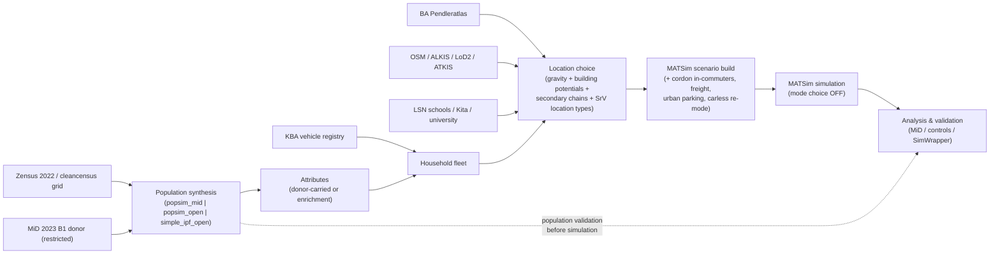

# eqasim-bs — synthetic population & MATSim scenario for Großraum Braunschweig

> 🚧 **Work in progress.** This project is under **active development** and not
> yet released. Interfaces, configuration keys, calibrated parameters, and
> outputs may still change between commits. It is already usable for research
> runs, but treat results as preliminary and pin a commit hash for
> reproducibility.

## Overview

**eqasim-bs is a regional fork of the [eqasim](https://github.com/eqasim-org)
pipeline**, built directly on top of
[`eqasim-org/eqasim-bavaria`](https://github.com/eqasim-org/eqasim-bavaria)
(forked @ `b20fbe6`, 2025-10-06 — ADR-0000). It re-uses the
[synpp](https://github.com/eqasim-org/synpp) DAG, stage structure, and MATSim
scenario builder; the Bavaria-specific data loaders are replaced by
Niedersachsen / Braunschweig equivalents, and a large body of data-driven
realism was added on top. If you know eqasim, you already know how this
pipeline is wired — see [`docs/generated/LINEAGE.md`](docs/generated/LINEAGE.md)
for exactly which stages are inherited, configured, extended, overridden, or
new, and [`docs/UPSTREAM_DELTA.md`](docs/UPSTREAM_DELTA.md) for the pinned fork
delta.

The pipeline produces:

1. A **synthetic population** (households, persons, daily activity chains,
   trips) of the Zweckverband Großraum Braunschweig at 1–100 % sampling.
2. A **MATSim scenario** (network, transit schedule, vehicles, plans) run by
   the project's own [`eqasim-java-bs`](#repository-ecosystem) fork.
3. **Analysis & validation output** (MiD validation report, population control
   fit, [SimWrapper](https://simwrapper.github.io/) dashboards).

Start with [`docs/MODEL_OVERVIEW.md`](docs/MODEL_OVERVIEW.md) for the 10-minute
scientific mental model, and [`docs/generated/STATUS.md`](docs/generated/STATUS.md)
for what is actually active in the current production configuration.

**Honesty note:** `mode_choice` is `false` in every committed configuration —
no calibrated modal split exists yet, so simulated mode shares are **not
behaviourally validated**, and mode-share convergence (the eqasim termination
criterion) is stability, not validation. Validation evidence lives in the run
manifests ([`docs/generated/RUNS.md`](docs/generated/RUNS.md)).

## Model scope

Region: **Zweckverband Großraum Braunschweig (ZGB-8)**, ~1.13 M inhabitants,
eight Kreise / kreisfreie Städte (ARS prefix `031`):

| AGS | Name | | AGS | Name |
|-----|------|-|-----|------|
| 03101 | SK Braunschweig | | 03153 | LK Goslar |
| 03102 | SK Salzgitter | | 03154 | LK Helmstedt |
| 03103 | SK Wolfsburg | | 03157 | LK Peine |
| 03151 | LK Gifhorn | | 03158 | LK Wolfenbüttel |

Excludes Göttingen (03159) and Northeim (03155) — outside the ZGB. Bounding box
(EPSG:25832 / UTM 32N): 542 000 – 691 000 E, 5 700 000 – 5 900 000 N. The
project-wide metric CRS is **EPSG:25832**.

## Architecture

Population generation is a **selectable workflow** behind one config switch,
`braunschweig.population.method`. All three methods fill the same synpp stage
contracts (via the config alias tables) and feed the SAME downstream
location-choice and MATSim stages:

| `population.method` | Synthesizer | Microdata seed | Activity chains | Geography |
|---|---|---|---|---|
| `popsim_mid` **(production)** | [PopulationSim](https://activitysim.github.io/populationsim/) | **MiD 2023 B1** raw microdata (restricted, local-only) | the donor's own MiD travel-day chain, validated + repaired | Zensus-2022 100 m / 1 km grid |
| `popsim_open` | PopulationSim | **open** ENTD 2008 households | ENTD diary chains | Zensus-2022 100 m / 1 km grid |
| `simple_ipf_open` | in-house IPF (4–6 margins) | none — census margins only | ENTD 2008 donor via statistical matching | Gemeinde / Kreis |



The authoritative technical pipeline (the actual synpp dependency graph,
extracted, not hand-drawn) is rendered in
[`docs/generated/PIPELINE.md`](docs/generated/PIPELINE.md); per-stage semantics
and Bavaria lineage live in the Stage Registry
([`docs/generated/STAGES.md`](docs/generated/STAGES.md)).

## Repository ecosystem

| Repository | Role | Where it must be |
|-----------|------|------------------|
| **[eqasim-bs](https://github.com/TUBS-IVS/eqasim-bs)** (this repo) | Python synpp pipeline: synthesis, locations, scenario export, analysis | anywhere |
| **[eqasim-java-bs](https://github.com/TUBS-IVS/eqasim-java-bs)** | own editable Java/MATSim fork (`braunschweig` module; parking, freight, SimWrapper contrib) — built by the pipeline via `eqasim_source_path` | sibling directory `../eqasim-java-bs` |
| **[cleancensus](https://github.com/TUBS-IVS/cleancensus)** | produces the prepared Zensus-2022 grid parquets (the PopulationSim control totals) | run separately; outputs copied under `eqasim-data/data/braunschweig/popsim/cells/` |
| **popsimprep** | PopulationSim environment (run as a `uv` subprocess in its own env) | path set via `braunschweig.population.popsim.popsimprep_dir` |
| [eqasim-org/eqasim-bavaria](https://github.com/eqasim-org/eqasim-bavaria) | upstream baseline (remote `upstream`) — read-only reference | — |
| [eqasim-org/eqasim-france](https://github.com/eqasim-org/eqasim-france) | active upstream development; fix sweeps are ported periodically (`docs/UPSTREAM_FIX_SWEEP.md`) | — |

## Requirements

- **Python 3.10** via miniforge/conda; the pinned environment is
  [`environment.yml`](environment.yml) (env name `eqasim`). The pipeline AND
  the test suite run in this env.
- **Java**: eqasim-java 2.2.0 targets **JDK 25**; point `java_home` /
  `java_binary` at it (see `configs/base_bs.yml`). Maven is resolved by the
  pipeline.
- **osmosis** and **osmconvert** for network extracts (`osmosis_binary`,
  `osmconvert_binary` config keys).
- ~64 GB RAM for 25 % runs; the 100 % all-features run is sized for a
  64-core / 128 GB machine.
- Disk: ~13 GB input data + caches (tens of GB at scale).

## Installation

```powershell
git clone https://github.com/TUBS-IVS/eqasim-bs.git
git clone https://github.com/TUBS-IVS/eqasim-java-bs.git   # sibling directory
cd eqasim-bs
& "$env:LOCALAPPDATA\miniforge3\shell\condabin\conda-hook.ps1"
conda env create -f environment.yml
conda activate eqasim
```

## Data setup

> **Data-protection policy.** This repository hosts **no** third-party
> statistical registers. The only committed data are small derived **aggregate
> reference tables** (`eqasim-data/data/braunschweig/{mid,srv}/…​.csv`,
> `braunschweig/kba/derived/*.csv`, `braunschweig/buildings/bosserhof_class_to_*.csv`,
> `braunschweig/calibration/detour_circuity_params.csv`,
> `braunschweig/lsn/lsn2022_income_tax_by_kreis.csv`,
> `braunschweig/nds_bbs_share_by_age.csv`) plus their provenance docs. **Everything else is
> downloaded/obtained by you** and placed under `eqasim-data/data/` at the exact
> path below. Restricted inputs are never committed and never redistributed.

The machine-readable source of truth for every dataset (provider, license,
roles, exact path, downloader, restrictions) is the **Data Registry**:
[`docs/registry/data/*.yml`](docs/registry/data/), rendered as a table in
[`docs/generated/DATA.md`](docs/generated/DATA.md). The tables below are the
setup-oriented summary; all target paths are **relative to `eqasim-data/data/`**.

### Automatically downloadable (script)

| Dataset | Command | Destination |
|---------|---------|-------------|
| RegioStaR typology (BMV/BBSR) | `python scripts/download_regiostar.py` | `regiostar/regiostar_referenzdatei.xlsx` |
| Zensus 2022 open 100 m grid | `python scripts/download_zensus_grid.py` | `zensus_grid/population_100m.parquet` |
| VerBindungen zones + commuter OD | `python scripts/download_verbindungen.py` | `verbindungen/` |
| german-wide-freight v3 (plans + DE/EU network) | `python scripts/download_german_wide_freight.py` | `braunschweig/freight/german-wide-freight-v3/` |
| Mikrozensus 2024 commuter tables | `python scripts/download_mikrozensus_pendler.py` | `braunschweig/mikrozensus/mikrozensus2024_*.csv` |
| BA commuter flows by NACE section (optional, parked feature) | `python scripts/download_ba_pendler_detailed.py` | `braunschweig/` (per-export name) |

### Manual downloads (open sources)

| Dataset | Where / which table | Destination (relative to `eqasim-data/data/`) |
|---------|---------------------|-----------------------------------------------|
| **VG250-EW** boundaries + population (BKG) | [gdz.bkg.bund.de](https://gdz.bkg.bund.de/index.php/default/digitale-geodaten/verwaltungsgebiete/) — GeoPackage UTM32s | `germany/vg250-ew_12-31.utm32s.gpkg.ebenen.zip` |
| **KBA FE4** driving licences | [kba.de](https://www.kba.de) — Fahrerlaubnisbestand FE4 | `germany/fe4_2024.xlsx` |
| **ENTD 2008** French HTS (open donor) | [statistiques.developpement-durable.gouv.fr](https://www.statistiques.developpement-durable.gouv.fr/enquete-nationale-transports-et-deplacements-entd-2008) | `entd_2008/{Q_individu,Q_tcm_individu,Q_menage,Q_tcm_menage_0,K_deploc,Q_ind_lieu_teg}.csv` |
| **DESTATIS 12411-0018** population Kreis×sex×age | [www-genesis.destatis.de](https://www-genesis.destatis.de/genesis/online) code `12411`, flat CSV | `braunschweig/12411-0018_de.csv` |
| **GENESIS 13111-06-02-4** SvB at residence | [regionalstatistik.de](https://www.regionalstatistik.de/genesis/online) code `13111` | `braunschweig/13111-06-02-4.xlsx` |
| **GENESIS 13111-01-03-5** SvB at workplace | regionalstatistik.de code `13111` | `braunschweig/13111-01-03-5.xlsx` |
| **BA gemband-dlk** employees by sector | [statistik.arbeitsagentur.de](https://statistik.arbeitsagentur.de) — Gemeindeband | `braunschweig/gemband-dlk-0-202506-xlsx.xlsx` |
| **BA Pendleratlas** Ein-/Auspendler (Kreis OD) | statistik.arbeitsagentur.de — Pendleratlas (krpend) | `braunschweig/statistik_pendler_2026042493412.csv` + `braunschweig/statistik_pendler_2026042493430.csv` |
| **Zensus 2022 5000H-2001** households by size | [ergebnisse.zensus2022.de](https://ergebnisse.zensus2022.de) flat file | `braunschweig/5000H-2001_de_flat.csv` |
| **Zensus 2022 1000A-2081** households size×type (optional IPF margin) | ergebnisse.zensus2022.de | `braunschweig/1000A-2081_de_flat.zip` |
| **Zensus 2022 1000A-3082** persons age×sex×size (optional) | ergebnisse.zensus2022.de | `braunschweig/1000A-3082_de_flat.zip` |
| **Zensus 2022 2000S-2001** employed by age | ergebnisse.zensus2022.de | `braunschweig/popsim/zensus2022_employment_by_age_ref.csv` |
| **BBSR INKAR** household income (+ optional panel) | [inkar.de](https://www.inkar.de) | `braunschweig/E_Haushaltseinkommen.xls` (+ `braunschweig/E_*.xls`) |
| **KBA FZ 27 / FZ 12.1 / EV series / 46251** fleet sources | kba.de + regionalstatistik.de | `braunschweig/kba/{fz27_202501.xlsx,fz12_2025.xlsx,raw/}` |
| **ALKIS Hausumringe NI** (~1.7 GB) | [opengeodata.lgln.niedersachsen.de](https://opengeodata.lgln.niedersachsen.de) | `braunschweig/buildings/gebaeude-ni.zip` |
| **ATKIS Basis-DLM landuse NI** (~3.2 GB) | opengeodata.lgln.niedersachsen.de | `braunschweig/landuse/FS_LN_03_NI_260101.zip` |
| **LGLN LoD2** building heights (tiles) | opengeodata.lgln.niedersachsen.de | preprocessed via `scripts/preprocess_lod2_heights.py` |
| **OSM Niedersachsen PBF** (~470 MB) | [download.geofabrik.de](https://download.geofabrik.de/europe/germany/niedersachsen-latest.osm.pbf) | `osm/niedersachsen-latest.osm.pbf` |
| **GTFS Germany (DELFI)** or ZGB feed | [opendata-oepnv.de](https://www.opendata-oepnv.de) (registration) | `gtfs_cordon/` (e.g. `gtfs_cordon/de_full_2026-06-02.zip`; config key `gtfs_path`) |
| **LSN Schulverzeichnis ABS+BBS** | [statistik.niedersachsen.de](https://www.statistik.niedersachsen.de) | processed to `braunschweig/schools/nds_schools_zgb.csv` via `scripts/extract_nds_schools.py` |
| **LSN Hochschulstatistik** (SS 2025) | statistik.niedersachsen.de | processed to `braunschweig/schools/nds_hochschulen.csv` via `scripts/seed_nds_hochschulen.py` |
| **LSN Kindertageseinrichtungen** (K2300112) | [nls.niedersachsen.de](https://www1.nls.niedersachsen.de/statistik/) | processed to `braunschweig/schools/nds_kitas_zgb.csv` via `scripts/extract_nds_kitas.py` |
| **VRB tariff zones** | [vrb-online.de](https://www.vrb-online.de/de/tickets/tarifzonen-preisstufen) | `vrb/tarifzonen.html` → `vrb/stations.json` via `scripts/build_vrb_stations_json.py` |

### Restricted / non-public inputs (never committed, never redistributed)

| Dataset | Needed for | How to obtain | Destination |
|---------|-----------|---------------|-------------|
| **MiD 2023 B1 microdata** (7 files: Haushalte, Personen, Wege, Autos, Etappen, Reisen, Tagesreisen) | the `popsim_mid` **production** workflow (donor); the `Autos` file additionally regenerates the committed fleet cross tables; the `Haushalte`/`Personen`/`Wege` files are also read at run time by the commute-day-state home-office donor pool (ADR-0104, below) | BASt [MobilityData-Campus](https://www.bast.de/DE/Publikationen/Daten/VerhaltenundSicherheit/MDC/MobilityData-Campus_node.html) (usage agreement; infas no longer distributes it) | donor path: `braunschweig/popsim/mid2023_raw/MiD2023_{Haushalte,Personen,Wege}.csv` · fleet tables read the full package from `<popsimprep>/inputs/MiD2023/MiD2023_B1_Datensatzpaket/CSV/` (or `--mid-path`) |
| **MiD 2023 regional report** (infas 7555 PDF) | regenerating the committed `braunschweig/mid/mid2023_*.csv` aggregates | delivery by ZGB / BMDV | `braunschweig/Ergebnistabellen_MiD2023_…_Braunschweig.pdf` → `scripts/extract_mid_tables.py` |
| **SrV 2023 BS+RGB trip records** | regenerating the committed `braunschweig/srv/srv2023_*.csv` aggregates (#224, #201, #262) | TU Dresden / Stadt BS / RGB scientific use | local SUF → `scripts/derive_srv_location_types.py` etc. |
| **RVB VISUM Verkehrszellen** | only the permanently-OFF TAZ feature (ADR-0067) | RVB delivery | `braunschweig/taz/rvb_verkehrszellen_epsg25832.parquet` |
| **urbistat Gemeinde age scrape** | legacy IPF Gemeinde share key only | `scripts/scrape_urbistat_bs.py` (non-redistributable) | `braunschweig/urbistat_age_gemeinden.csv` |

Without the restricted MiD B1 package the `popsim_open` and `simple_ipf_open`
workflows still run end-to-end on open data; the committed MiD/SrV aggregate
tables keep all reference comparisons working.

### Derived / preprocessed inputs (generated locally)

| Input | Generate with | Destination |
|-------|---------------|-------------|
| ALKIS buildings parquet | `python scripts/preprocess_alkis_landuse.py` | `braunschweig/preprocessed/alkis_buildings.parquet` |
| ATKIS landuse parquet | (same script) | `braunschweig/preprocessed/landuse.parquet` |
| OSM POIs parquet | `python scripts/preprocess_osm_pois.py` | `braunschweig/preprocessed/osm_pois.parquet` |
| Cordon ring network extract | `python scripts/clip_osm_to_cordon_ring.py` | `osm/germany-latest.zgb_ring.osm.pbf` + `osm/cordon/` |
| **cleancensus grid cells** (PopulationSim control totals) | [cleancensus](https://github.com/TUBS-IVS/cleancensus) pipeline (separate repo) | `braunschweig/popsim/cells/zensus2022_grid_{100m_de_prepared,1km_de_binned}.parquet` |
| cleancensus Kreis control tables | cleancensus pipeline | `braunschweig/popsim/kreis_controls/` |
| Buildings-with-households (cell-linked) | popsimprep preprocessing step 5 | `braunschweig/popsim/buildings/buildings_with_households_zgb.parquet` |
| Building activity potentials | TUBS-IVS potentials pipeline → `python scripts/import_building_activity_potentials.py` | `braunschweig/buildings/building_activity_potentials.parquet` |
| HSN/TSN engine lookup | `python scripts/scrape_hsn_tsn.py` | `braunschweig/kba/hsn_tsn_lookup.csv` |
| KBA derived fleet tables (committed) | `python scripts/extract_kba_fleet.py` | `braunschweig/kba/derived/*.csv` |
| MiD fleet cross tables (committed) | `python scripts/build_mid_age_by_segment_status.py` and `python scripts/build_mid_antrieb_by_status.py` (both accept `--mid-path`) | `braunschweig/kba/derived/mid2023_{age_by_segment_status,antrieb_by_status}.csv` |
| MiD ownership cross tables (committed) | `python scripts/extract_mid_ownership_by_rs7_haustyp.py` (accepts `--raw` / `--out-dir`) | `braunschweig/mid/mid2023_cars_by_rs7_haustyp.csv`, `braunschweig/mid/mid2023_bikes_by_rs7_haustyp.csv` |
| SrV primary-distance targets (committed) | `python scripts/extract_srv_primary_distance_targets.py --raw <srv2023_raw dir> --out-dir eqasim-data/data/braunschweig/srv` (raw SciUse microdata local-only) | `braunschweig/srv/srv2023_commute_distance_by_kreis.csv`, `braunschweig/srv/srv2023_education_distance_by_kreis_level.csv`, `braunschweig/srv/srv2023_commute_distance_quantiles_by_kreis.csv`, `braunschweig/srv/srv2023_commute_distance_sensitivity_by_kreis.csv` (sensitivity variants, not a target) |
| SrV work-participation reference (committed) | `python scripts/extract_srv_work_participation.py --raw <srv2023_raw dir> --out-dir eqasim-data/data/braunschweig/srv --source-commit <sha>` (raw SciUse microdata local-only) | `braunschweig/srv/srv2023_work_participation_by_kreis.csv` |
| SrV plan-structure reference (committed) | `python scripts/extract_srv_plan_structure.py --raw <srv2023_raw dir> --out-dir eqasim-data/data/braunschweig/srv --source-commit <sha>` (raw SciUse microdata local-only) | `braunschweig/srv/srv2023_plan_structure_reference.csv` — read by the `plan_structure_vs_srv` analysis stage, which aborts if it is missing |
| SrV participation-universe aggregates (committed) | `python scripts/extract_srv_participation_universe.py --raw <srv2023_raw dir> --out-dir eqasim-data/data/braunschweig/srv --source-commit <sha>` (raw SciUse microdata local-only); both tables come out of one run | `braunschweig/srv/srv2023_work_by_employment_by_kreis.csv`, `braunschweig/srv/srv2023_education_by_age_by_kreis.csv` — build-time inputs of the participation-universe targets below, not read at run time |
| Participation-universe Kreis targets (committed) | `python scripts/build_participation_universe_targets.py` (no raw data: reads the two SrV aggregates above and the committed `target2026_employment_status_by_kreis.csv`) | `braunschweig/targets/target2026_work_by_employment_by_kreis.csv`, `braunschweig/targets/target2026_education_{0_5,6_17,18plus}_by_kreis.csv` — read by the popsim stage whenever the controls of issue #368 are on (the default) |
| MiD reporting-day work-location + home-office donor-pool references (committed) | `python scripts/extract_mid_workday_location.py --raw <mid2023_raw dir> --out-dir eqasim-data/data/braunschweig/mid --source-commit <sha>` (raw MiD microdata local-only); read at run time by the commute-day-state model (ADR-0104, below). The model's own run-time donor pool (data record `mid2023_home_office_day_donors`) has no separate file: it is rebuilt fresh from the raw MiD delivery on every run. | `braunschweig/mid/mid2023_workday_location_by_commute_distance.csv`, `braunschweig/mid/mid2023_home_office_donor_pool.csv` |

Two diagnostics check the synthesised fleet against those committed references
(they read data only and write nothing):

```bash
python scripts/measure_combustion_split.py        # realised petrol/diesel vs 46251-02 (ZGB)
python scripts/measure_gemeinde_join_coverage.py  # Gemeinde-name join coverage of the EV tilt
```

The exhaustive acquisition companion (with every note and edge case) is
[`eqasim-data/DOWNLOAD_CHECKLIST_BS.md`](eqasim-data/DOWNLOAD_CHECKLIST_BS.md).

## Verify your setup

One canonical preflight checks every expected input and prints per dataset
`[OK] / [MISSING] / [OPTIONAL] / [RESTRICTED] / [GENERATED]` with its source:

```powershell
python scripts/verify_braunschweig_inputs.py            # synthesis inputs
python scripts/verify_braunschweig_inputs.py --matsim   # + MATSim-only inputs
```

`[RESTRICTED]` means "obtain via the usage agreement", `[GENERATED]` means "run
the listed script". The metadata layer itself is verified with:

```powershell
python -m braunschweig.documentation check   # registries, config, DAG, docs
```

## Running the model

**Canonical (composed) configuration** — a fixed feature base plus a thin
per-scale overlay; every feature flag lives exactly once in the base
(ADR-0070). The resolved config is written to
`<working_directory>/.merged_config.yml`:

```powershell
# canonical production target (100 %, all features, popsim_mid):
python scripts/run_synpp.py configs/base_bs.yml configs/overlays/test_100pct.yml
# current validated scale (25 %):
python scripts/run_synpp.py configs/base_bs.yml configs/overlays/test_25pct.yml
# 1-Kreis smoke of the composed set:
python scripts/run_synpp.py configs/base_bs.yml configs/overlays/test.yml
```

**Plan-structure config keys (`popsim_mid` only).** These seven keys govern how a
MiD donor's reporting day becomes a MATSim plan — and five of them
(`diary_plan_match`, `exclude_holiday_plan_sources`, `exclude_rbw_legs`,
`drop_leading_arrive_home_leg`, `closure_dwell_model`) reach further than the
plan-source pool and the trip build: since issue #374 they steer the Phase B
home-office **donor pool** as well, so one setting decides both which diaries a
plan may come from and which diaries a home-office day may be spliced in from.
All are default ON in `configs/base_bs.yml`, which stays the single home of
every flag and its default value (the table is here because the three trip-side
keys must be turned OFF on the ENTD path, see below); the rationale is
ADR-0106 / ADR-0107 / ADR-0108 and the feature records `diary_plan_match`,
`rbw_leg_convention`, `home_closure_model`, `commute_day_state`.

| Key (prefix `braunschweig.population.popsim.`) | Effect |
|---|---|
| `diary_plan_match` | Re-draws a plan source whose MiD diary was not collected (`anzwege1` 803/804) or whose only legs are rbW legs to a matched realisable weekday diary |
| `exclude_holiday_plan_sources` | Excludes public-holiday reporting days (`feiertag == 1`) from plan sources and from the remap donor pool |
| `exclude_rbw_legs` | Drops `W_RBW == 1` legs from the day plan (the round happens inside the work activity); keeps `rbwLegsCount` / `rbwDistanceKm` as person attributes |
| `drop_leading_arrive_home_leg` | Drops a first leg that *arrives* home (`W_SO1 == 2`) instead of fabricating a home→home first trip |
| `closure_dwell_model` | Draws the dwell before the synthesised return-home trip from observed durations (purpose × arrival band); `fixed_1h` restores the previous 3600 s constant byte-identically, including no plan-time cap |
| `closure_dwell_min_obs` | Minimum observations a (purpose × arrival band) cell of that empirical model needs before it is drawn from directly; thinner cells fall back to the purpose marginal (integer, not a flag) |
| `trip_class_seed_counts_closure` | Counts the closed day in the `trip_class` PopulationSim seed (`anzwege1 + 1` for an open-ended source), so seed, plan and SrV target count the same day |

See `configs/base_bs.yml` for each key's current default value.

`exclude_rbw_legs`, `drop_leading_arrive_home_leg` and `closure_dwell_model`
need MiD columns (`W_RBW`, `W_SO1`) and the MiD Wege table that ENTD does not
have, so the ENTD donor source **rejects** any non-default value: the two
`popsim_open` fixture configs set them to `false` / `fixed_1h` explicitly.
(`closure_dwell_min_obs` needs no such rejection — it only sizes the empirical
model's cells, which that rejection already prevents from ever being built.)

**Participation-universe control keys (`popsim_mid` only).** Five more keys
decide WHICH persons the trip-participation controls constrain (issue #368,
ADR-0109, feature record `participation_universe_controls`). Two of them replace
an older control by default and the two they replace are therefore OFF; the
defaults themselves live only in `configs/base_bs.yml`, as for every other flag.
Every Kreis attribute control is inert for a non-MiD donor source, so no ENTD
rejection is needed here.

| Key (prefix `braunschweig.population.popsim.`) | Effect |
|---|---|
| `work_by_employment_kreis_control` | Constrains four MECE cells over persons 14+ — employment status × whether the realised plan has a directly recorded work leg — instead of one all-persons work share. **Replaces** `work_participation_kreis_control` |
| `work_participation_kreis_control` | The replaced all-persons work-participation control; kept registered (and its target file committed) for ablation configs |
| `education_by_age_kreis_control` | One toggle for three 2-cell (`edu`/`noedu`) controls on the age ranges 0–5, 6–17 and 18+, each with a census-exact band total. **Replaces** `education_participation_kreis_control` |
| `education_participation_kreis_control` | The replaced all-persons education-participation control; likewise kept for ablation configs |
| `diary_match_hard_employment` | Forbids the diary plan match from relaxing the `employed` match key, so a person's employment attribute and their work diary cannot come from two different MiD respondents; surviving crossings are counted and logged |

Enabling a replacement together with the control it replaces — or a replacement
while `employment_status_kreis_control` is off — fails at **config time** with a
`ValueError` naming both keys, rather than double-constraining the same persons.

**Local open-data smokes** (no restricted MiD data needed):

```powershell
python scripts/run_synpp.py configs/fixtures/config_local_braunschweig.yml     # 1 % IPF
python scripts/run_synpp.py configs/fixtures/config_smoke_popsim_open_mini.yml # popsim_open mini
```

Always launch the pipeline through `scripts/run_synpp.py`. Besides logging, provenance and
cache priming it installs the deterministic stage-hash patch (`braunschweig/synpp_deterministic.py`,
ADR-0105) before synpp builds the stage graph; a plain `python -m synpp` run names cache
entries nondeterministically (synpp 1.6.2 propagates implicit config keys in a
`PYTHONHASHSEED`-dependent order) and therefore misses caches at random.

A 0.1 % CI dry run is `configs/fixtures/config_dryrun_braunschweig.yml`. The
random seed is fixed at `1234` and the gravity slope at `-0.065` across all
configs. Production runs execute on a 64c/128GB Linux server (`scripts/
run_pipeline.sh`, `scripts/sync_data_to_server.ps1`); the preflight verifier
gates `run_pipeline.sh` (skip with `EQASIM_SKIP_VERIFY=1`).

### Commute-day-state model

`python scripts/run_synpp.py` remains the single entry point; the model itself is governed
by four keys in `configs/base_bs.yml` plus one analysis-stage default
(`cds_max_states_outside_employed_share`, not set in `configs/base_bs.yml` — see below;
ADR-0104, issue #244) that give every employed person with an assigned workplace a
reporting-day state in `{at_workplace, home, absent}` — a person drawn to `home` receives a
matched MiD home-office-day donor's own trip chain, and a person drawn to `absent` makes no
trip that day:

| Key | Default | Meaning |
|---|---|---|
| `commute_day_state_enabled` | `true` | Master switch. `false` leaves every worker `at_workplace` and every `.final` stage a byte-identical pass-through of the pre-assignment day. |
| `commute_day_far_threshold_km` | `200.0` (km, routed) | Assigned commute distance above which a not-kept worker may become `absent`. **ASSUMPTION**: the MiD `P_ARB_ENTF` top-code — the survey resolves nothing above it, so this is where the reference stops, not where behaviour is known to change. |
| `commute_day_absent_share_far` | `1.0` (share, `0`–`1`) | Share of not-kept far workers that become `absent` rather than `home`. **ASSUMPTION**: no observed rate exists; the pre-registered sensitivity check (ADR-0104) also runs this at `0.6`. |
| `commute_day_max_not_replaceable_share` | `0.5` (share, `0`–`1`) | Guard: above this share of the `home` cohort without any donor at any coarsening level, the model raises rather than silently reporting a home share governed by donor-pool gaps. |
| `cds_max_states_outside_employed_share` | `0.05` (share, `0`–`1`; code default of the analysis stage, not set in `configs/base_bs.yml`) | Diagnostic guard on `braunschweig.analysis.synthesis.work_participation_by_kreis`'s Check 1: raises above this share of drawn states falling outside the employed universe (an id-join defect, not a measurement). |

The drawn state is exported as the `commute_day_state` column of `persons.csv` (empty for a
person without an assigned workplace) and, in the MATSim population, as the person attribute
`commuteDayState` (written only for persons that carry a state). See
[`docs/codebase/notes/commute-day-two-view-trips.md`](docs/codebase/notes/commute-day-two-view-trips.md)
for the two-view trips architecture this model relies on.

## Outputs

- `working_directory` (per overlay, e.g. `eqasim-data/cache_bs_100pct_allfeat_popsim/`)
  — synpp stage cache incl. `.merged_config.yml`.
- `output_path` (e.g. `eqasim-data/output_bs_100pct_allfeat_popsim/`) — the
  synthetic population (CSV/parquet), MATSim scenario files, analysis reports,
  SimWrapper bundle.
- MATSim `simulation_output/` is archived into `<output_path>/matsim_output/`
  (run-named, survives cache wipes; ADR-0064).
- `<working_directory>/monitoring/` — this run's own resource time series
  (`resource_series_<timestamp>.jsonl`, one sample every 30 s) plus the
  `.summary.md` / `.summary.json` written when the run ends: peak per-worker RSS,
  per-stage wall/CPU split, disk high-water mark, kernel OOM/segfault counts
  (ADR-0100). Produced for every run, including one that fails; the markdown block
  is meant to be pasted into the run manifest. `monitoring_enabled: false` switches
  it off.
- Every significant run gets a **run manifest** under
  [`docs/runs/`](docs/runs/) — the authoritative record of what ran and what it
  was validated against.

## Documentation

Information is maintained once (machine-readable) and rendered into views —
see [`docs/DOCUMENTATION_GOVERNANCE.md`](docs/DOCUMENTATION_GOVERNANCE.md) for
the full ownership model:

| You want to know… | Read |
|---|---|
| How the model works (10 min) | [`docs/MODEL_OVERVIEW.md`](docs/MODEL_OVERVIEW.md) |
| What is active in production right now | [`docs/generated/STATUS.md`](docs/generated/STATUS.md) |
| The actual pipeline / stage semantics / Bavaria lineage | [`docs/generated/PIPELINE.md`](docs/generated/PIPELINE.md), [`docs/generated/STAGES.md`](docs/generated/STAGES.md), [`docs/generated/LINEAGE.md`](docs/generated/LINEAGE.md) |
| Feature evidence (tests, references, validation runs) | [`docs/generated/FEATURES.md`](docs/generated/FEATURES.md) + `docs/registry/features/` |
| Every dataset, its license and exact path | [`docs/generated/DATA.md`](docs/generated/DATA.md) + `docs/registry/data/` |
| Why a decision was made (incl. rejected ideas) | [`docs/generated/DECISIONS.md`](docs/generated/DECISIONS.md) + `docs/decisions/` |
| What ran and what it proved | [`docs/generated/RUNS.md`](docs/generated/RUNS.md) + `docs/runs/` |
| Scientific method details per feature | [`docs/features/`](docs/features/) |
| Codebase conventions / testing / architecture notes | [`docs/codebase/`](docs/codebase/) |

Rebuild the generated views with `python -m braunschweig.documentation build`;
never edit `docs/generated/*` by hand.

## Contributing

See [`CONTRIBUTING.md`](CONTRIBUTING.md) — the canonical workflow (brainstorm →
plan → worktree → TDD → verify → review → PR → record) and the registry upkeep
duties (new stage → Stage Registry, new feature → Feature Registry, new dataset
→ Data Registry + verifier + this README, decision → ADR, significant run →
run manifest, then `python -m braunschweig.documentation check`).

## Issues / support

Open work is tracked exclusively as **GitHub issues on the fork**:
<https://github.com/TUBS-IVS/eqasim-bs/issues> (templates: feature / bug /
decision). PRs always target `TUBS-IVS/eqasim-bs:main` — never the
`eqasim-org/eqasim-bavaria` upstream.

## Citation

If you use this code or the synthetic population it produces, please cite both
the upstream eqasim methodology and this regional fork (see
[`CITATION.cff`](CITATION.cff)):

```
Hörl, S. and Balac, M. (2021). Synthetic population and travel demand
for Paris and Île-de-France based on open and publicly available data.
Transportation Research Part C: Emerging Technologies, 130, 103291.
https://doi.org/10.1016/j.trc.2021.103291

eqasim-bs (2026). Synthetic population for the Großraum Braunschweig
region. https://github.com/TUBS-IVS/eqasim-bs
```

## License

Code: GPL-3.0 (inherited from upstream eqasim). Generated synthetic population
data: see the individual input licences in the
[Data Registry](docs/generated/DATA.md); the most restrictive input licence
requires non-commercial use of any output that depends on it. The MiD 2023 B1
and SrV 2023 microdata are restricted scientific-use files and must never be
redistributed.
