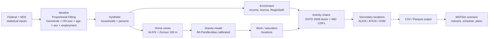

# eqasim-bs — synthetic population for Großraum Braunschweig

> **Status:** active development.
> Region scope: Zweckverband Großraum Braunschweig (ZGB-8, ARS prefix `031`),
> ~1.13 M inhabitants. Forked from
> [`eqasim-org/eqasim-bavaria`](https://github.com/eqasim-org/eqasim-bavaria) @ `b20fbe6`.

This repository builds an open synthetic population of the
**Zweckverband Großraum Braunschweig (ZGB)** for use as input to
agent-based transport simulations such as
[MATSim](https://matsim.org). It is a regional fork of the eqasim
pipeline, region-locked to Braunschweig and fed by German open data
(BKG, DESTATIS, BBSR, BA, LGLN, BMV, LSN, OpenStreetMap, Zensus 2022)
and the MiD 2023 regional sample.

Education activity locations (schools, kindergartens, universities) are
assigned by **dedicated, data-driven gravity models** on real
Niedersachsen facility registers (LSN), calibrated against MiD 2023 and
the DESTATIS Mikrozensus 2024 — see the education sections in
[`CLAUDE.md`](CLAUDE.md) and sections E/F of
[`eqasim-data/DOWNLOAD_CHECKLIST_BS.md`](eqasim-data/DOWNLOAD_CHECKLIST_BS.md).
The small aggregate reference tables that drive and calibrate these
models are committed directly to the repository, so the pipeline
reproduces from a clean checkout without re-downloading the underlying
registers.

The pipeline is implemented as a content-hashed
[synpp](https://github.com/eqasim-org/synpp) DAG in Python 3.10 and
produces:

1. A synthetic population (households, persons, daily activity chains,
   trips) at 1 %, 10 %, or 25 % sampling rate.
2. A MATSim scenario (network, transit schedule, vehicle definitions,
   plans) ready for `matsim-{plans|main}` runs.

## Region scope (ZGB-8)

Eight Kreise / kreisfreie Städte (AGS prefixes):

| AGS | Name |
|-----|------|
| 03101 | SK Braunschweig |
| 03102 | SK Salzgitter |
| 03103 | SK Wolfsburg |
| 03151 | LK Gifhorn |
| 03153 | LK Goslar |
| 03154 | LK Helmstedt |
| 03157 | LK Peine |
| 03158 | LK Wolfenbüttel |

Excludes Göttingen (03159) and Northeim (03155) — outside ZGB.
Bounding box (UTM 32N): 542 000 – 691 000 E, 5 700 000 – 5 900 000 N.

## Quickstart

### 1. Clone

```powershell
git clone https://github.com/<owner>/eqasim-bs.git
cd eqasim-bs
```

### 2. Environment

The pinned environment is described in [`environment.yml`](environment.yml)
(Python 3.10, pinned scientific stack). Using miniforge:

```powershell
& "$env:LOCALAPPDATA\miniforge3\shell\condabin\conda-hook.ps1"
conda env create -f environment.yml
conda activate eqasim
```

### 3. Inputs

Download every dataset listed in
[`eqasim-data/DOWNLOAD_CHECKLIST_BS.md`](eqasim-data/DOWNLOAD_CHECKLIST_BS.md)
and place each file under the indicated path inside `eqasim-data/data/`.
Two preprocessing scripts must be run once after the initial download:

```powershell
python scripts/preprocess_alkis_landuse.py    # ALKIS + ATKIS -> parquet
python scripts/preprocess_osm_pois.py         # OSM PBF       -> parquet
python scripts/download_regiostar.py          # auto-fetch RegioStaR
python scripts/download_zensus_grid.py        # auto-fetch 100 m grid
```

Verify the inventory:

```powershell
python scripts/verify_braunschweig_inputs.py --matsim
```

### 4. Run

| Sample | Config | Output | Wall time (laptop) |
|--------|--------|--------|--------------------|
| 1 %  | [`config_local_braunschweig.yml`](config_local_braunschweig.yml) | `eqasim-data/output_bs/` | ~10 min |
| 10 % | [`config_local_braunschweig_10pct.yml`](config_local_braunschweig_10pct.yml) | `eqasim-data/output_bs_10pct/` | ~4 h |
| 25 % | [`config_local_braunschweig_25pct.yml`](config_local_braunschweig_25pct.yml) | `eqasim-data/output_bs_25pct/` | ~10 h |

```powershell
python -m synpp config_local_braunschweig.yml
```

A 0.1 % CI dry run (`config_dryrun_braunschweig.yml`) is available for
smoke-testing without producing artefacts. Seed is fixed at `1234` and
gravity slope at `-0.065` across all configs — see
[`AGENTS.md`](AGENTS.md) for the rules around changing those.

## Input data — download checklist

The full inventory with target paths, source URLs, and licences lives in
[`eqasim-data/DOWNLOAD_CHECKLIST_BS.md`](eqasim-data/DOWNLOAD_CHECKLIST_BS.md).
Summary table (see the checklist for full paths and licences):

| Group | Datasets |
|-------|----------|
| **A. Federal** | VG250-EW (BKG), KBA Fahrerlaubnisbestand FE4, ENTD 2008 (HTS donor) |
| **B. Niedersachsen / Braunschweig** | DESTATIS 12411-0018 + urbistat shares (population), GENESIS 13111-06-02-4 / 13111-01-03-5 (employment), BA gemband-dlk (Wirtschaftsabteilungen), BA Pendleratlas Ein-/Auspendler CSVs, Zensus 2022 5000H-2001 households, BBSR INKAR Haushaltseinkommen (+ optional full panel), MiD 2023 regional table volume + extracted CSVs, RegioStaR-7, Zensus 100 m grid |
| **C. Preprocessed** | ALKIS Hausumringe → `alkis_buildings.parquet`, ATKIS Basis-DLM → `landuse.parquet`, OSM Niedersachsen → `osm_pois.parquet` |
| **D. MATSim-only** | OSM Niedersachsen PBF, GTFS Deutschland (Delfi or ZGB) |

Licences span dl-de/by-2-0, dl-de/zero-2-0, ODbL 1.0, BA terms, and
BMDV non-commercial (MiD 2023). Re-distribution rules apply per
dataset; see the checklist.

## Pipeline architecture



Region-neutral building blocks live under
[`eqasim_common/`](eqasim_common/); region overrides under
[`braunschweig/`](braunschweig/). The former `bavaria/` tree of
inherited upstream modules has been removed; the few utilities still
needed were migrated into `eqasim_common/` and `braunschweig/`.

For the synpp DAG and stage layout, see
[`docs/codebase/ARCHITECTURE.md`](docs/codebase/ARCHITECTURE.md) and
[`docs/codebase/STRUCTURE.md`](docs/codebase/STRUCTURE.md).

## How eqasim-bs differs from eqasim-bavaria

| Area | eqasim-bavaria | eqasim-bs |
|------|----------------|-----------|
| Region | Free State of Bavaria (~13 M) | Großraum Braunschweig ZGB-8 (~1.1 M) |
| Population reference | GENESIS Bavaria 12111-101 | DESTATIS 12411-0018 + urbistat Gemeinde shares |
| Employment OD | LfStat Bavaria pendler XLSX | BA Pendleratlas 2025 CSVs (Ein-/Auspendler) |
| Households | Derived from MiD-Bayern | Zensus 2022 5000H-2001 (Gemeinde × size × type) |
| Income | LfStat Bavaria | BBSR INKAR Haushaltseinkommen (Kreis × year) |
| Buildings | OSM tags | ALKIS Hausumringe (LGLN) — preprocessed parquet |
| Landuse | OSM tags | ATKIS Basis-DLM (LGLN) — preprocessed parquet |
| Travel survey | MiD-Bayern | MiD 2023 regional sample for distance / mode CDFs; ENTD 2008 still feeds activity chains |
| Spatial fix | Bavaria-wide | ARS prefixes 031xx pinned in every config |

## Calibration & validation

- The gravity model is calibrated to BA Pendleratlas Kreis × Kreis flows
  (Poisson-GLM MLE on 939 ZGB pairs, current slope `β = -0.065`).
- The household-size IPF margin is taken directly from Zensus 2022.
- Commute distance CDFs are sampled from MiD 2023 P13 (Kreis-level)
  and override the ENTD-derived distances for ZGB residents.
- Validation harness (10 % run): [`scripts/validate_bs_10pct.py`](scripts/validate_bs_10pct.py).
- Quality-playbook protocols: [`quality/QUALITY.md`](quality/QUALITY.md),
  [`quality/RUN_FUNCTIONAL_TESTS.md`](quality/RUN_FUNCTIONAL_TESTS.md),
  [`quality/RUN_INTEGRATION_TESTS.md`](quality/RUN_INTEGRATION_TESTS.md),
  [`quality/RUN_CODE_REVIEW.md`](quality/RUN_CODE_REVIEW.md),
  [`quality/RUN_SPEC_AUDIT.md`](quality/RUN_SPEC_AUDIT.md).

Test gate: `pytest tests/ -q` → 171 tests collected (smoke / pipeline /
determinism tests are opt-in via `EQASIM_BS_RUN_PIPELINE=1`).

## Known limitations

- The activity-chain donor is still ENTD 2008 (French HTS); a German
  HTS replacement is open work.
- 11 documented bugs from the upstream Bavaria pipeline remain tracked
  in [`docs/codebase/CONCERNS.md`](docs/codebase/CONCERNS.md). Per
  Decision D-5 (see [`AGENTS.md`](AGENTS.md)), the refactor is
  behaviour-preserving; only bugs that actively block the BS pipeline
  are fixed inline.
- The Java MATSim package is still `org.eqasim.bavaria.*`; renaming is
  out of scope for this refactor (Decision D-1c).

## Documentation

- [`AGENTS.md`](AGENTS.md) — single-page bootstrap for AI / human contributors.
- [`docs/codebase/`](docs/codebase) — architecture, stack, conventions, integrations, testing, concerns.
- [`docs/population.md`](docs/population.md) — upstream Bavaria population doc, partially applicable.
- [`docs/simulation.md`](docs/simulation.md) — upstream MATSim run doc, partially applicable.
- [`plan/refactor-eqasim-bs.md`](plan/refactor-eqasim-bs.md) — current refactor phase plan.
- [`quality/QUALITY.md`](quality/QUALITY.md) — fitness-to-purpose scenarios.

## Citation

If you use this code or the synthetic population it produces, please
cite both the upstream eqasim methodology and this regional fork. See
[`CITATION.cff`](CITATION.cff).

```
Hörl, S. and Balac, M. (2021). Synthetic population and travel demand
for Paris and Île-de-France based on open and publicly available data.
Transportation Research Part C: Emerging Technologies, 130, 103291.
https://doi.org/10.1016/j.trc.2021.103291

eqasim-bs (2026). Synthetic population for the Großraum Braunschweig
region. https://github.com/<owner>/eqasim-bs
```

## License

Code: GPL-3.0 (inherited from upstream eqasim).
Generated synthetic population data: see individual input licences;
the most restrictive (MiD 2023) requires non-commercial use of any
output that depends on it.
