# eqasim-bs — synthetic population for Großraum Braunschweig

> 🚧 **Work in progress.** This project is under **active development** and
> not yet released. Interfaces, configuration keys, calibrated parameters,
> and outputs may still change between commits. It is already usable for
> research runs, but treat results as preliminary and pin a commit hash for
> reproducibility.

## Built on eqasim

**eqasim-bs is a regional fork of the [eqasim](https://github.com/eqasim-org)
pipeline.** It is built directly on top of
[`eqasim-org/eqasim-bavaria`](https://github.com/eqasim-org/eqasim-bavaria)
(branched @ `b20fbe6`) and re-uses its
[synpp](https://github.com/eqasim-org/synpp) DAG, stage structure, and MATSim
scenario builder. The Bavaria-specific data loaders are replaced by
Niedersachsen / Braunschweig equivalents, while the region-neutral eqasim
machinery (synthesis, location assignment, MATSim export) is inherited largely
unchanged. If you know eqasim, you already know how this pipeline is wired —
only the regional inputs and a handful of calibrated, Braunschweig-specific
models differ (see
[*How eqasim-bs differs from eqasim-bavaria*](#how-eqasim-bs-differs-from-eqasim-bavaria)).

**Region scope:** Zweckverband Großraum Braunschweig (ZGB-8, ARS prefix
`031`), ~1.13 M inhabitants.

This repository builds an open **synthetic population** of the ZGB for use as
input to agent-based transport simulations such as
[MATSim](https://matsim.org). It is region-locked to Braunschweig and fed by
German open data (BKG, DESTATIS, BBSR, BA, LGLN, BMV, LSN, OpenStreetMap,
Zensus 2022) and the MiD 2023 household travel survey.

The pipeline is implemented as a content-hashed
[synpp](https://github.com/eqasim-org/synpp) DAG in Python 3.10 and
produces:

1. A synthetic population (households, persons, daily activity chains,
   trips) at 1 %, 10 %, 25 %, or 100 % sampling rate.
2. A MATSim scenario (network, transit schedule, vehicle definitions,
   plans) ready for `matsim-{plans|main}` runs.
3. Optionally, a [SimWrapper](https://simwrapper.github.io/) dashboard
   bundle for interactive result inspection.

### Highlights

- **Three selectable population-synthesis workflows** — one config switch
  (`braunschweig.population.method`) chooses between the in-house IPF with the
  open French ENTD 2008 trip donor (`simple_ipf_open`), a
  [PopulationSim](https://activitysim.github.io/populationsim/)-based synthesis
  at the Zensus-2022 100 m grid with the open ENTD seed (`popsim_open`), or the
  same PopulationSim machinery seeded with the restricted **MiD 2023** raw
  microdata (`popsim_mid`) — the highest-fidelity variant, in which every
  synthetic person carries a real German donor's attributes **and** travel-day
  chain. See [Population synthesis workflows](#population-synthesis-workflows).
- **Real German open data end to end** — population, employment, commuting,
  households, income, buildings, and land use are all sourced from
  authoritative federal / Niedersachsen registers (no synthetic proxies).
- **Calibrated commuting gravity model** — work and education trips follow a
  distance-decay model fitted to BA Pendleratlas Kreis-pair flows, with a
  per-RegioStaR-7 slope so urban and rural origins decay at their own rate.
- **Data-driven education location models** — schools, kindergartens, and
  universities are assigned by dedicated gravity models on real
  Niedersachsen facility registers (LSN), calibrated against MiD 2023 and the
  DESTATIS Mikrozensus 2024. See the education sections in
  [`CLAUDE.md`](CLAUDE.md) and sections E/F of
  [`eqasim-data/DOWNLOAD_CHECKLIST_BS.md`](eqasim-data/DOWNLOAD_CHECKLIST_BS.md).
- **Cross-cordon commuter injection (flag-gated)** — in- and out-commuters
  crossing the ZGB boundary are generated from BA Pendleratlas Kreis flows,
  enter through network gates / rail stations chosen by a population-gravity
  model, and are injected into the MATSim scenario as a fixed-mode
  `incommuter` subpopulation, with per-gate validation outputs.
- **Household vehicle fleet model (flag-gated)** — household cars are
  instantiated as a realistic fleet (KBA brand mix, HSN/TSN engine attributes,
  electric-share tilt) instead of generic default vehicles.
- **SimWrapper dashboards** — a synpp export stage writes a multi-tab
  SimWrapper bundle (demographics, mode shares, choropleths, commuter flows)
  for any run output.
- **Privacy-conscious, fully documented data** — for data-protection reasons
  this repository hosts **no** third-party statistical registers. Only a small set
  of derived **aggregate reference tables** is committed; every other input is
  downloaded by you from its official source. Each dataset is documented below
  with its exact source, table/code, target path, and licence so anyone can
  reproduce the run — see [Input data](#input-data--what-to-download).

## Region scope (ZGB-8)

Eight Kreise / kreisfreie Städte (AGS prefixes):

| AGS | Name |
|-----|------|
| 03101 | SK Braunschweig |
| 03102 | SK Salzgitter |
| 03103 | SK Wolfsburg |
| 03151 | LK Gifhorn |
| 03153 | LK Goslar |
| 03154 | LK Helmstedt |
| 03157 | LK Peine |
| 03158 | LK Wolfenbüttel |

Excludes Göttingen (03159) and Northeim (03155) — outside ZGB.
Bounding box (UTM 32N): 542 000 – 691 000 E, 5 700 000 – 5 900 000 N.

## Quickstart

### 1. Clone

```powershell
git clone https://github.com/<owner>/eqasim-bs.git
cd eqasim-bs
```

### 2. Environment

The pinned environment is described in [`environment.yml`](environment.yml)
(Python 3.10, pinned scientific stack). Using miniforge:

```powershell
& "$env:LOCALAPPDATA\miniforge3\shell\condabin\conda-hook.ps1"
conda env create -f environment.yml
conda activate eqasim
```

### 3. Inputs

Download every dataset listed in
[`eqasim-data/DOWNLOAD_CHECKLIST_BS.md`](eqasim-data/DOWNLOAD_CHECKLIST_BS.md)
and place each file under the indicated path inside `eqasim-data/data/`.
Two preprocessing scripts must be run once after the initial download:

```powershell
python scripts/preprocess_alkis_landuse.py    # ALKIS + ATKIS -> parquet
python scripts/preprocess_osm_pois.py         # OSM PBF       -> parquet
python scripts/download_regiostar.py          # auto-fetch RegioStaR
python scripts/download_zensus_grid.py        # auto-fetch 100 m grid
```

Verify the inventory:

```powershell
python scripts/verify_braunschweig_inputs.py --matsim
```

### 4. Run

| Sample | Config | Output | Wall time (laptop) |
|--------|--------|--------|--------------------|
| 1 %  | [`config_local_braunschweig.yml`](config_local_braunschweig.yml) | `eqasim-data/output_bs/` | ~10 min |
| 10 % | [`config_local_braunschweig_10pct.yml`](config_local_braunschweig_10pct.yml) | `eqasim-data/output_bs_10pct/` | ~4 h |
| 25 % | [`config_local_braunschweig_25pct.yml`](config_local_braunschweig_25pct.yml) | `eqasim-data/output_bs_25pct/` | ~10 h |

```powershell
python -m synpp config_local_braunschweig.yml
```

A 0.1 % CI dry run (`config_dryrun_braunschweig.yml`) is available for
smoke-testing without producing artefacts. Seed is fixed at `1234` and
gravity slope at `-0.065` across all configs — see
[`AGENTS.md`](AGENTS.md) for the rules around changing those.

## Population synthesis workflows

Population generation is a **selectable workflow** behind one config switch,
`braunschweig.population.method`. All three methods produce the same unified
persons/households/trips schema and feed the SAME downstream location-choice
and MATSim stages, so results are directly comparable:

| `population.method` | Synthesizer | Microdata seed | Activity chains | Geography |
|---|---|---|---|---|
| `simple_ipf_open` *(default)* | in-house IPF (4–6 margins, age-aware household composition) | none — census margins only | ENTD 2008 donor via statistical matching, MiD 2023 CDF overrides | Gemeinde / Kreis |
| `popsim_open` | [PopulationSim](https://activitysim.github.io/populationsim/) | **open** ENTD 2008 households (full composition) | ENTD diary chains; non-diary members matched to diary donors (immobility preserved via the diary flag) | Zensus-2022 100 m / 1 km grid |
| `popsim_mid` | PopulationSim | **MiD 2023 B1** raw microdata (restricted, local-only) | the donor's own MiD travel-day chain (Wege), validated + repaired | Zensus-2022 100 m / 1 km grid |

Key properties of the PopulationSim workflows:

- **Complete donor households** are expanded against age × sex grid controls
  (1 km batches, cell-disjoint merge); member-incomplete MiD seed households
  (~17 %) are filled by mirror-household sampling so household sizes match the
  declared `H_GR`.
- **MiD missing-data policy** — every donor attribute goes through one uniform,
  logged policy (structural design codes mapped deterministically, item
  non-response imputed within age/household-size groups, unenumerated codes
  fail fast). Times that MiD does not collect for regular commute trips
  (code 701, ~10 % of Wege) are imputed from the person's own `wegmin_imp1`
  durations plus empirical anchors, so real commuter chains are preserved;
  structurally broken chains are replaced by attribute-matched donor chains.
- **Mobility quota** (share of persons leaving home) is reproduced from the
  donors and validated against MiD 2023 P36_1 (~80 % mobile in the ZGB).
- **Data protection** — `popsim_mid` requires the restricted MiD 2023 B1 CSV
  package locally (never committed); raw donor ids are pseudonymised to
  numeric surrogates before any output, and the surrogate↔raw map stays in the
  local work directory. `popsim_open` is provably MiD-free (the MiD path is
  only read when `popsim_mid` is selected).

Run configs: [`config_popsim_mid_braunschweig.yml`](config_popsim_mid_braunschweig.yml),
[`config_popsim_open_braunschweig.yml`](config_popsim_open_braunschweig.yml);
1 % smoke twins `config_smoke_{simple_ipf,popsim_mid,popsim_open}[_mini].yml`
plus the read-only three-case comparator
[`validate_three_cases.py`](validate_three_cases.py).

## Input data — what to download

> **Data-protection policy.** This repository hosts **no** third-party
> statistical data. The only data files committed are small derived
> **aggregate reference tables** (`eqasim-data/data/braunschweig/mid/mid2023_*.csv`,
> a few rows each) and the project's own calibration-evaluation outputs
> (`.../mid/education_calibration/*`). **Every dataset below must be downloaded
> by you** from its official source and placed under `eqasim-data/data/` at the
> indicated path.

All target paths are **relative to `eqasim-data/data/`**. After downloading,
verify the inventory with:

```powershell
python scripts/verify_braunschweig_inputs.py            # synthesis.output inputs
python scripts/verify_braunschweig_inputs.py --matsim   # + MATSim-only inputs
```

The script prints `[OK]` / `[--]` per dataset. The exhaustive companion (with
every note and edge case) is
[`eqasim-data/DOWNLOAD_CHECKLIST_BS.md`](eqasim-data/DOWNLOAD_CHECKLIST_BS.md);
the tables below are the primary, self-contained guide.

### A. Federal datasets (shared across regions)

| Dataset | Where / which table | Target path |
|---------|---------------------|-------------|
| **VG250-EW 31.12.** — administrative boundaries with population (BKG) | [gdz.bkg.bund.de](https://gdz.bkg.bund.de/index.php/default/digitale-geodaten/verwaltungsgebiete/verwaltungsgebiete-1-250-000-mit-einwohnerzahlen-stand-31-12-vg250-ew-31-12.html) — VG250-EW (GeoPackage UTM32s) | `germany/vg250-ew_12-31.utm32s.gpkg.ebenen.zip` |
| **KBA Fahrerlaubnisbestand FE4** — driving licences by Bundesland | [kba.de](https://www.kba.de/DE/Statistik/Kraftfahrer/Fahrerlaubnisse/Fahrerlaubnisbestand/fahrerlaubnisbestand_node.html) — table FE4 | `germany/fe4_2024.xlsx` |
| **ENTD 2008** — French national HTS, reused as the activity-chain donor | [statistiques.developpement-durable.gouv.fr](https://www.statistiques.developpement-durable.gouv.fr/enquete-nationale-transports-et-deplacements-entd-2008) | `entd_2008/{Q_individu,Q_tcm_individu,Q_menage,Q_tcm_menage_0,K_deploc,Q_ind_lieu_teg}.csv` |

### B. Niedersachsen / Braunschweig statistical inputs (`synthesis.output`)

| Dataset | Where / which table | Target path |
|---------|---------------------|-------------|
| **Population** — DESTATIS 12411-0018, Kreis × sex × age class | [www-genesis.destatis.de](https://www-genesis.destatis.de/genesis/online) code `12411` (Flat-CSV) | `braunschweig/12411-0018_de.csv` |
| **Gemeinde population shares** — urbistat age table (11 classes) | [urbistat.com](https://urbistat.com) — Gemeinde age table | `braunschweig/urbistat_age_gemeinden.csv` |
| **Employees by residence** — GENESIS 13111-06-02-4 | [regionalstatistik.de](https://www.regionalstatistik.de/genesis/online) code `13111` | `braunschweig/13111-06-02-4.xlsx` |
| **Employees at workplace** — GENESIS 13111-01-03-5 | regionalstatistik.de code `13111` | `braunschweig/13111-01-03-5.xlsx` |
| **Employees by Wirtschaftsabteilung** — BA gemband-dlk | [statistik.arbeitsagentur.de](https://statistik.arbeitsagentur.de) — Beschäftigung, Gemeindeband | `braunschweig/gemband-dlk-0-202506-xlsx.xlsx` |
| **Commuters — Einpendler** (Arbeitsort ZGB) | statistik.arbeitsagentur.de — Pendleratlas (krpend) | `braunschweig/statistik_pendler_2026042493412.csv` |
| **Commuters — Auspendler** (Wohnort ZGB) | same Pendleratlas explorer | `braunschweig/statistik_pendler_2026042493430.csv` |
| **Households** — Zensus 2022 5000H-2001, Gemeinde × HH-size × type | [ergebnisse.zensus2022.de](https://ergebnisse.zensus2022.de) table `5000H-2001` (Flat-File) | `braunschweig/5000H-2001_de_flat.csv` |
| **Household income** — BBSR INKAR (Kreis × year) | [inkar.de](https://www.inkar.de) — `E_Haushaltseinkommen.xls` | `braunschweig/E_Haushaltseinkommen.xls` |
| **Additional aggregate reference tables** — small committed numbered tables (a few rows each) | **committed** (`mid/mid2023_*.csv`); raw source only needed to regenerate | `braunschweig/mid/mid2023_*.csv` |
| **RegioStaR-7** — BMV/BBSR Gemeinde typology | auto-download: `python scripts/download_regiostar.py` | `regiostar/regiostar_referenzdatei.xlsx` |
| **Zensus 100 m population grid** | auto-download: `python scripts/download_zensus_grid.py` | `zensus_grid/population_100m.parquet` |

### C. Large geodata (downloaded once, then preprocessed to parquet)

The synpp pipeline reads only the compact GeoParquet; the raw archives are not
loaded by stages. Run the two preprocessors (see [Quickstart](#3-inputs)).

| Raw input | Where | Target path → preprocessed output |
|-----------|-------|-----------------------------------|
| **ALKIS Hausumringe Niedersachsen** (~1.7 GB) | [opengeodata.lgln.niedersachsen.de](https://opengeodata.lgln.niedersachsen.de) — "Hausumringe Niedersachsen" | `braunschweig/buildings/gebaeude-ni.zip` → `braunschweig/preprocessed/alkis_buildings.parquet` |
| **ATKIS Basis-DLM landuse Niedersachsen** (~3.2 GB) | opengeodata.lgln.niedersachsen.de — "ATKIS Basis-DLM" | `braunschweig/landuse/FS_LN_03_NI_260101.zip` → `braunschweig/preprocessed/landuse.parquet` |
| **OSM Niedersachsen PBF** (~470 MB) | [download.geofabrik.de](https://download.geofabrik.de/europe/germany/niedersachsen-latest.osm.pbf) | `osm/niedersachsen-latest.osm.pbf` → `braunschweig/preprocessed/osm_pois.parquet` |

### D. MATSim-only inputs (only for `matsim.output`)

| Dataset | Where | Target path |
|---------|-------|-------------|
| **OSM Niedersachsen PBF** (same file as C) | download.geofabrik.de | `osm/niedersachsen-latest.osm.pbf` |
| **GTFS Deutschland (Delfi) or ZGB feed** | [opendata-oepnv.de](https://www.opendata-oepnv.de/ht/de/organisation/delfi/startseite) / [zgb.de](https://www.zgb.de) | `gtfs/<any>.zip` |
| **VRB tariff zones** (ÖV-fare module) | [vrb-online.de](https://www.vrb-online.de/de/tickets/tarifzonen-preisstufen) → `scripts/build_vrb_stations_json.py` | `vrb/tarifzonen.html` → `vrb/stations.json` |

### E. Education facility inputs (only with `education_gravity_enabled: true`)

These build the school / kindergarten / university gravity models. The derived
facility CSVs are **not committed** (data-protection); download the raw LSN
registers and regenerate them with the listed scripts. See
[`eqasim-data/data/braunschweig/schools/README.md`](eqasim-data/data/braunschweig/schools/README.md)
and `DATA_FLOW.md` for the full provenance.

| Raw input | Where | Regenerate → output (local only) |
|-----------|-------|----------------------------------|
| **LSN Schulverzeichnis ABS + BBS** (allgemein- + berufsbildende Schulen) | [statistik.niedersachsen.de](https://www.statistik.niedersachsen.de) — `Schulverzeichnis_ABS_2025.xlsx`, `Verzeichnis_der_BBS_2024.xlsx` | `scripts/extract_nds_schools.py` → `schools/nds_schools_zgb.csv` |
| **LSN Studierende nach Hochschule** (SS2025) | statistik.niedersachsen.de — Hochschulstatistik | `scripts/seed_nds_hochschulen.py` → `schools/nds_hochschulen.csv` |
| **LSN Kindertageseinrichtungen — Plätze** (table K2300112) | [nls.niedersachsen.de](https://www1.nls.niedersachsen.de/statistik/) — Kinder-/Jugendhilfestatistik | `scripts/extract_nds_kitas.py` → `schools/nds_kitas_zgb.csv` |
| **DESTATIS Mikrozensus 2024** — school-trip distance by school type | [destatis.de](https://www.destatis.de) — Mikrozensus Pendler tables | `scripts/seed_mikrozensus_school_distance.py` → `mikrozensus/mikrozensus2024_*.csv` |
| **MiD 2023 Tabelle 43** — school distance by RegioStaR-7 × age | **committed** (`mid/mid2023_T43_school_distance_by_rs7.csv`) | `scripts/seed_mid_t43_school_distance.py` |

### F. PopulationSim workflow inputs (only for `popsim_open` / `popsim_mid`)

The PopulationSim workflows additionally need the prepared Zensus-2022 grid
cell tables and (for `popsim_mid` only) the restricted MiD 2023 microdata. All
of these are **local-only** (never committed); the paths are configured under
`braunschweig.population.popsim.*` — see
[`docs/population/DATA_LAYOUT.md`](docs/population/DATA_LAYOUT.md).

| Input | Where | Target (config key) |
|-------|-------|---------------------|
| **Zensus 2022 grid cells, 100 m + 1 km** (prepared parquet with age × sex bands, household controls, RegioStaR) | derived from [ergebnisse.zensus2022.de](https://ergebnisse.zensus2022.de) grid downloads | `cells_100m_path`, `cells_1km_path` |
| **MiD 2023 B1 Datensatzpaket** (faktisch anonymisierte CSV: Haushalte, Personen, Wege) — `popsim_mid` only | restricted scientific-use file, BMDV / infas | `mid_raw_path` (dir with `MiD2023_{Haushalte,Personen,Wege}.csv`) |
| **PopulationSim environment** (runs as a `uv` subprocess in its own env) | [activitysim/populationsim](https://activitysim.github.io/populationsim/) | `popsimprep_dir`, `uv_path`, `controls_path`, `settings_path` |

Licences span dl-de/by-2-0 (BKG, Statistische Ämter, BA, BBSR, BMV),
dl-de/zero-2-0 (LGLN ALKIS/ATKIS), and ODbL 1.0 (OSM); some inputs carry
stricter terms — check each dataset before reuse. The MiD 2023 B1 microdata is
a restricted scientific-use file and must never be redistributed.

## Pipeline architecture

```mermaid
flowchart LR
    A[Federal + NDS<br/>statistical inputs] --> SEL{population.method}
    SEL -->|simple_ipf_open| IPF[Iterative<br/>Proportional Fitting<br/>Gemeinde × HH-size × age × sex × employment]
    SEL -->|popsim_open / popsim_mid| PS[PopulationSim<br/>Zensus-2022 100 m grid<br/>ENTD or MiD 2023 seed]
    IPF --> POP[Synthetic<br/>households + persons]
    PS --> POP
    POP --> ENR[Enrichment / donor attributes<br/>income, licence, PT, RegioStaR]
    POP --> HOME[Home zones<br/>ALKIS + Zensus 100 m]
    HOME --> GRAV[Gravity model<br/>BA Pendleratlas calibrated]
    GRAV --> WORK[Work / education<br/>locations]
    ENR --> CHAIN[Activity chains<br/>ENTD donor matching or<br/>own MiD Wege + MiD CDFs]
    WORK --> CHAIN
    CHAIN --> SEC[Secondary locations<br/>ALKIS / ATKIS / OSM]
    SEC --> OUT[CSV / Parquet output]
    OUT --> MATSIM[MATSim scenario<br/>network, schedule, plans,<br/>household fleet]
    CORD[Cross-cordon commuters<br/>BA Pendleratlas + gates] --> MATSIM
    MATSIM --> SW[SimWrapper dashboard]
```



Region-neutral building blocks live under
[`eqasim_common/`](eqasim_common/); region overrides under
[`braunschweig/`](braunschweig/) (incl. the population-method selector in
`braunschweig/population/`, the PopulationSim workflow in
`braunschweig/popsim/`, the cordon machinery in `braunschweig/data/cordon/` +
`braunschweig/synthesis/incommuters.py`, and the SimWrapper export in
`braunschweig/analysis/simwrapper/`). The former `bavaria/` tree of
inherited upstream modules has been removed; the few utilities still
needed were migrated into `eqasim_common/` and `braunschweig/`.

The authoritative module-level documentation for the calibrated subsystems is
[`CLAUDE.md`](CLAUDE.md); workflow-specific docs live in
[`docs/population/`](docs/population) (popsim data layout, id scheme) and
[`docs/runs/`](docs/runs) (run monitors and validation summaries).

## How eqasim-bs differs from eqasim-bavaria

| Area | eqasim-bavaria | eqasim-bs |
|------|----------------|-----------|
| Region | Free State of Bavaria (~13 M) | Großraum Braunschweig ZGB-8 (~1.1 M) |
| Population reference | GENESIS Bavaria 12111-101 | DESTATIS 12411-0018 + urbistat Gemeinde shares |
| Employment OD | LfStat Bavaria pendler XLSX | BA Pendleratlas 2025 CSVs (Ein-/Auspendler) |
| Households | Derived from MiD-Bayern | Zensus 2022 5000H-2001 (Gemeinde × size × type) |
| Income | LfStat Bavaria | BBSR INKAR Haushaltseinkommen (Kreis × year) |
| Buildings | OSM tags | ALKIS Hausumringe (LGLN) — preprocessed parquet |
| Landuse | OSM tags | ATKIS Basis-DLM (LGLN) — preprocessed parquet |
| Travel survey | MiD-Bayern | MiD 2023 for distance / mode CDFs; ENTD 2008 still feeds activity chains |
| Spatial fix | Bavaria-wide | ARS prefixes 031xx pinned in every config |

### Modelling and engineering changes on top of upstream

Beyond swapping the regional inputs, a few model and code changes were made
relative to eqasim-bavaria. They are intentionally additive — the upstream
behaviour is preserved unless a change is explicitly enabled:

- **Per-RegioStaR-7 gravity slope.** The commuting gravity model keeps the
  eqasim distance-decay friction but differentiates the slope by the
  origin Gemeinde's RegioStaR-7 class (urban vs. rural), calibrated on a single
  identified full-panel Poisson GLM over BA Pendleratlas Kreis-pair flows. The
  flow-weighted mean equals the scalar slope, so the regional mean commute is
  unchanged.
- **Data-driven education location models (flag-gated).** Schools,
  kindergartens, and universities are assigned by dedicated gravity models on
  real LSN facility registers instead of the generic OSM hard-radius sampler.
  Off by default (`education_gravity_enabled=false` → byte-identical to the
  legacy assignment); on, the slopes are calibrated against MiD 2023 Tabelle 43
  and the DESTATIS Mikrozensus 2024.
- **MiD-based categorical enrichment.** PT subscription type and driving
  licence are drawn from a three-margin IPF (raking) on MiD 2023 Tabellen P24.1
  / P17.1 (Kreis × sex × age), replacing the legacy single-target seeding and
  the KBA-based licence model. The boolean flags (`has_pt_subscription`,
  `has_license`) are derived from the categorical attributes.
- **Commute-distance override.** ZGB residents' commute distances are sampled
  from MiD 2023 P13 Kreis-level CDFs, overriding the ENTD-derived distances.
- **PopulationSim workflows (flag-selected).** Beside the IPF, two
  PopulationSim-based synthesis workflows generate the population directly at
  the Zensus-2022 100 m grid from complete donor households (open ENTD or
  restricted MiD 2023 seed) — see
  [Population synthesis workflows](#population-synthesis-workflows).
- **Cell-accurate popsim home locations.** The PopulationSim workflows place
  each household in an area-weighted ALKIS building INSIDE its own Zensus-2022
  100 m cell (`braunschweig.synthesis.locations.home_cell`), preserving the grid
  precision PopulationSim produces instead of re-sampling anywhere in the
  municipality (~97 % cell-accurate on the smoke; the rest fall back to a
  commune draw where the cell has no mapped building, logged). The legacy/IPF
  workflows keep the Gemeinde-level home sampler.
- **Cross-cordon commuter injection (flag-gated).** `cordon_enabled` adds in-
  and out-commuters from BA Pendleratlas Kreis flows: road gates and rail entry
  stations are derived from the network ∩ cordon polygon, agents get
  donor-timed home–work–home plans and enter MATSim as a fixed-mode
  `incommuter` subpopulation; counts scale linearly with `sampling_rate` and a
  validation stage writes per-gate CSV/GPKG reports.
- **Household vehicle fleet (flag-gated).** `vehicles_method: household`
  instantiates per-household vehicle fleets with KBA brand mix and HSN/TSN
  engine attributes, with an electric-share calibration per Kreis/Gemeinde;
  `remode_carless_car_legs` keeps plans consistent with the fleet.
- **Urban parking cost (flag-gated).** `enable_urban_parking` marks inner-city
  residents so the Java mode-choice applies parking cost inside the BS inner
  ring.
- **MiD economic-status and income models.** `economic_status` is sampled from
  the MiD Haushaltstyp × Region distribution (Bayes), household income from
  empirical MiD distributions with INKAR per-Kreis scaling — consistent across
  all three population workflows (`high_income` = ≥ 5000 EUR/month uniformly).
- **SimWrapper export.** A synpp stage (`braunschweig.analysis.simwrapper_export`)
  writes a multi-tab SimWrapper dashboard (demographics, mode shares,
  choropleths, commuter tab) from any run output.
- **Reference values as CSV tables, not Python literals.** All survey / census
  reference numbers live as versioned CSV tables and are regenerated only via
  dedicated seed scripts. For data-protection reasons only the small derived
  **aggregate reference tables** are committed; the other reference and
  LSN-derived tables are kept local and regenerated from their official sources — see
  [`CLAUDE.md`](CLAUDE.md) and the
  [Input data](#input-data--what-to-download) guide.
- **Repository hygiene.** The inherited `bavaria/` tree was removed (its few
  still-needed utilities migrated into `eqasim_common/` / `braunschweig/`).

## Calibration & validation

- The gravity model is calibrated to BA Pendleratlas Kreis × Kreis flows
  (Poisson-GLM MLE on 939 ZGB pairs, current slope `β = -0.065`).
- The household-size IPF margin is taken directly from Zensus 2022.
- Commute distance CDFs are sampled from MiD 2023 P13 (Kreis-level)
  and override the ENTD-derived distances for ZGB residents.
- Run-level validation: `python -m braunschweig.analysis.run_full_analysis`
  (dashboard + MiD validation) and the PopulationSim-style control validation
  in `braunschweig/analysis/population_validation/` (incl. mobility quota vs
  MiD P36_1, trip purposes vs W1, per-Kreis controls).
- Three-workflow comparability: [`validate_three_cases.py`](validate_three_cases.py)
  reads the three smoke outputs side by side (demographics, licence/PT shares,
  mobility quota).
- Quality-playbook protocols: [`quality/QUALITY.md`](quality/QUALITY.md),
  [`quality/RUN_FUNCTIONAL_TESTS.md`](quality/RUN_FUNCTIONAL_TESTS.md),
  [`quality/RUN_INTEGRATION_TESTS.md`](quality/RUN_INTEGRATION_TESTS.md),
  [`quality/RUN_CODE_REVIEW.md`](quality/RUN_CODE_REVIEW.md),
  [`quality/RUN_SPEC_AUDIT.md`](quality/RUN_SPEC_AUDIT.md).

Test gate: `pytest tests/ -q -k "not test_pipeline and not test_simulation and
not test_determinism and not smoke"` → ~1 500 tests green (smoke / pipeline /
determinism tests are opt-in via `EQASIM_BS_RUN_PIPELINE=1`).

## Known limitations

- The `simple_ipf_open` and `popsim_open` workflows still use the ENTD 2008
  (French HTS) as the trip donor; only `popsim_mid` carries native German
  (MiD 2023) activity chains — and it requires the restricted MiD B1 microdata
  locally.
- PopulationSim controls currently constrain age × sex (+ household totals) at
  the grid level; employment and income are donor-carried, not yet controlled —
  the popsim workflows therefore inherit some MiD donor skew in those margins
  (Kreis-level employment / income count controls are planned).
- The Java MATSim package is still `org.eqasim.bavaria.*`; renaming is
  out of scope for this refactor (Decision D-1c).

## Documentation

- [`AGENTS.md`](AGENTS.md) — single-page bootstrap for AI / human contributors.
- [`CLAUDE.md`](CLAUDE.md) — authoritative module guide for the calibrated
  subsystems (MiD reference tables, gravity, education, status/income models).
- [`docs/population/`](docs/population) — popsim workflow docs (data layout,
  id scheme, POPSIM_MID).
- [`docs/runs/`](docs/runs) — run monitors and validation summaries (incl. the
  2026-06-11 popsim bugfix-wave summary).
- [`docs/population.md`](docs/population.md) — upstream Bavaria population doc, partially applicable.
- [`docs/simulation.md`](docs/simulation.md) — upstream MATSim run doc, partially applicable.
- [`quality/QUALITY.md`](quality/QUALITY.md) — fitness-to-purpose scenarios.

## Citation

If you use this code or the synthetic population it produces, please
cite both the upstream eqasim methodology and this regional fork. See
[`CITATION.cff`](CITATION.cff).

```
Hörl, S. and Balac, M. (2021). Synthetic population and travel demand
for Paris and Île-de-France based on open and publicly available data.
Transportation Research Part C: Emerging Technologies, 130, 103291.
https://doi.org/10.1016/j.trc.2021.103291

eqasim-bs (2026). Synthetic population for the Großraum Braunschweig
region. https://github.com/<owner>/eqasim-bs
```

## License

Code: GPL-3.0 (inherited from upstream eqasim).
Generated synthetic population data: see individual input licences;
the most restrictive input licence requires non-commercial use of any
output that depends on it.
