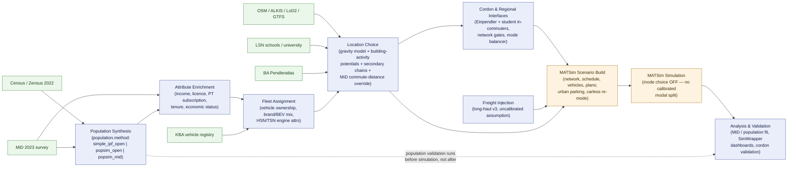

# ARCHITECTURE

## Abstract pipeline view (feature-oriented, current as of 2026-08-09)

> This section is the current, verified high-level view. It deliberately
> abstracts away synpp stage/module names (those are in the alias table
> further down, itself dated 2026-06-26 and not re-verified here) and groups
> the pipeline by **feature category**, matching `PROJECT_STATUS.md`'s matrix
> categories (`[Synthesis]`, `[Attrs]`, `[Fleet]`, `[Location]`, `[Cordon]`,
> `[Freight]`, `[Analysis]`, `[Infra]`). Everything below the next banner is
> older, stage-level detail kept for reference; where the two disagree, trust
> `PROJECT_STATUS.md`'s feature matrix and the code over either diagram.



Reading notes:

- **Population Synthesis is a three-way fork behind one config switch**
  (`population.method`), not three separate pipelines — `popsim_open` and
  `popsim_mid` share all PopulationSim machinery and differ only in the seed
  donor (open vs. MiD 2023). `simple_ipf_open` is the legacy in-house IPF path.
  Production runs currently use `popsim_mid` (`configs/base_bs.yml`).
  Several `[Attrs]` enrichment flags (economic status, PT subscription,
  income-aware cars, etc.) live in the legacy IPF enrichment stage and are
  dead code under the active `popsim_mid` method — see `docs/readiness/*.yml`
  per-feature declarations for which flags are genuinely live under which
  method.
- **Cordon and freight injection happen late, at the terminal MATSim
  writers** (`braunschweig/matsim/scenario/*.py` concat wrappers), not as an
  earlier population-synthesis step — they add agents/demand on top of the
  already-synthesised population rather than feeding back into it.
- **Analysis splits across two points in time**: population/controls
  validation runs on the synthesised population before any simulation;
  MiD-behaviour and SimWrapper validation run after the MATSim simulation
  produces events. The dashed edge above marks this.
- Mode choice is OFF in every run config — there is no calibrated modal
  split; treat the `SIM` box as producing route/schedule assignment under
  fixed mode choice, not a validated behavioural forecast.

---

> **CURRENT STATE — 2026-06-26 (read this first).** The sections below dated
> 2026-06-08/10 are HISTORICAL (they describe the `feature/education-gravity-bs`
> / popsim-refactor era). This banner block reflects the actual current state.
> Authoritative source remains `CLAUDE.md`.

## Feature inventory — what was implemented in the last weeks (verified from `git log --all`)

### Merged to `origin/main` (HEAD `ff26d45`, via PR #15/#16/#17)

| Area | Feature | Evidence |
|---|---|---|
| Location choice | **Building activity potentials** (PR #16, #17). Work + secondary location choice now **REPLACE** the ALKIS candidate set with OSM/ALKIS `building_activity_potentials.parquet` buildings, weighted by per-activity potential (`potential_work`, `potential_retail_daily/non_daily`, `potential_leisure`). Education + kita/university capacity distributed by building potential. chainsolvers pinned to commit `d8d8ae7`. | git `Merge PR #16`, `#17`; `braunschweig/data/building_potentials.py`, `braunschweig/locations/work.py`, `braunschweig/synthesis/locations/secondary_chainsolvers.py`; `CLAUDE.md` "Building-level activity potentials" |
| Fleet | **Fleet consistency v2** (PR #12) + **income-age coupling** (PR #13): brand HSN/TSN feasibility, per-Kreis BEV/PHEV recalibration, income-coupled vehicle age. | git PR #12/#13; memory `model-realism-data-integration.md` |
| Home | **ALKIS-typed home matching** (PR #14): height-type buildings, H_GEW/P_GEW weighted weekend matching. | git PR #14 |
| Controls | **Employment grid control** refined to **5 age groups**; **tier-3 Kreis controls** (via cleancensus kreis_controls import). | git 2026-06-18/22 |
| Caching | **cache_share Tier A/B** (prime-on-launch) + `braunschweig.popsim.completed_donor` stage (donor build shared across all runs). | git 2026-06-22; `CLAUDE.md` "Shared persistent stage-cache" |
| Analysis | **Integerizer-quality / PopulationSim-style controls-validation** report (GPKG maps, per-cell realised-vs-target error, % diff plot). | git 2026-06-23; `braunschweig/analysis/popsim_validation/` |
| Robustness | popsim BLAS/OpenMP single-thread pin, batch concurrency cap (OOM fix), cordon in-commuter `car_passenger`/`default_car` fixes. | git 2026-06-23/24 |

### On branch `worktree-calibration-corner` — NOT merged, 53 commits ahead of main

> The full calibration work lives in worktree `.claude/worktrees/calibration-corner`
> (tip `1870265`). The main checkout's `feature/calibration-corner` is **53 commits
> behind** this and carries only a partial/older state. **All calibration work below
> must be done on `worktree-calibration-corner`.**

1. **Calibration corner** `braunschweig/calibration/` — consolidated home for all
   calibration logic. Modules: `metrics.py` (band-share/EMD/detour), `targets.py`
   (P13 + per-RS7 + W12 band-share loaders), `commute.py` (Furness update / sparse
   shrinkage / validation report), `circuity.py` + `detour_fit.py` (Tier 3),
   `secondary.py` (Tier 3A scorer coordinate-descent), and `_legacy_*` shims for the
   3 migrated calibrators. Evidence: `git ls-tree worktree-calibration-corner braunschweig/calibration/`.
2. **Commute distribution calibration** (per-band gravity friction → MiD P13). Built
   as infrastructure; **measured already-matches P13 (EMD ~0.065 < 0.08) → NOT pinned,
   stays OFF / byte-identical.** The committed "0.47 FAIL" was stale. Config key
   `gravity_friction_factors` (None default). Evidence: `CLAUDE.md` calibration section;
   memory `feedback-measure-before-calibrating.md`.
3. **Purpose-resolved secondary distances** (the "new MiD plans"): **Tier 1**
   `braunschweig/popsim/distance_distributions.py` builds distance distributions per
   **(purpose × mode)** instead of mode-only; **Tier 2** `braunschweig/popsim/shop_subtype.py`
   splits shop → shop_daily / shop_non_daily (MiD W_ZWD) driving both desired distance
   and building potential. Consumed only by `secondary_chainsolvers.py` (secondary
   activities) — **does NOT touch the education path**. Flag-gated (`secondary_distance_by_purpose`,
   `secondary_shop_daily_split`); ON only in the 2 all-features popsim configs.
4. **Tier 3 distance-dependent detour/circuity** c(d): built, **measured immaterial vs
   constant 1.3 → constant kept as default, curve opt-in (`mode="curve"`)**.
5. **Tier 3A per-purpose scorer-weight coordinate descent** (`calibration/secondary.py`):
   INFRASTRUCTURE ONLY, **not activated** — gated on the Secondary ON-run showing a
   shop residual vs W12.

## How activity location choice is structured (the building-potential question)

Work/education attraction is a **two-level system**:
- **Level 1 — zone totals are real:** the gravity model attraction = SvB-am-Arbeitsort
  per Gemeinde (GENESIS 13111, real employment) for work; real LSN enrollment/Plaetze
  for education. These zone/facility totals are the authoritative controls.
- **Level 2 — within-zone split = building potential:** `potential_work` (volume ×
  `bosserhof_class` redistributed within a TAZ) decides which building inside a zone
  receives the activity. It is a high-quality **proxy**, not an observed per-building
  headcount. No observed worker-headcount-per-building dataset exists on disk
  (`buildings_with_households_NI` has `hh_count` = residential only).

---

How the `eqasim-bs` pipeline is wired. Verified from `configs/fixtures/config_local_braunschweig.yml`
(the synpp run + alias map), `CLAUDE.md`, and the stage source files.

## synpp content-hashed DAG

The pipeline is a [synpp](https://github.com/eqasim-org/synpp) DAG. Each stage is
a Python module exposing:

- `configure(context)` — declares config keys and upstream stage dependencies.
- `execute(context)` — produces the stage output (cached by a content hash of
  inputs + config).
- (optionally) `validate(...)` — cache-invalidation hook.

Verified signature in `braunschweig/synthesis/locations/education_gravity.py`
(`def configure(context)` line 239, `def execute(context)` line 310). synpp
caches every stage under the `working_directory` (`eqasim-data/cache_bs*`), so a
rerun only re-executes stages whose hashed inputs changed.

## Terminal stages

`configs/fixtures/config_local_braunschweig.yml` requests two terminal outputs:

```yaml
run:
  - synthesis.output    # CSV / Parquet synthetic population
  - matsim.output       # MATSim scenario (network, schedule, vehicles, plans)
```

## Stage aliasing: fork over upstream

The DAG's structure is upstream eqasim's, but `aliases:` remap individual stage
names to the Braunschweig fork (`braunschweig.*`) or the region-neutral package
(`eqasim_common.*`). synpp resolves aliases **one step deep** only — a
documented constraint that forces several stages (e.g.
`synthesis.population.enriched`) to alias *directly* to the fork rather than
chaining through an intermediate (see the inline comment in the config and
CLAUDE.md). Representative remaps (from `configs/fixtures/config_local_braunschweig.yml`):

| Upstream stage | Aliased to |
|----------------|-----------|
| `data.census.filtered` | `braunschweig.ipf.attributed` |
| `synthesis.population.income.selected` | `braunschweig.synthesis.income` |
| `synthesis.population.spatial.home.zones` | `braunschweig.synthesis.spatial.home_zones` |
| `synthesis.locations.home.locations` | `braunschweig.locations.home` |
| `synthesis.locations.education` | `eqasim_common.locations.education` |
| `synthesis.locations.secondary` | `braunschweig.locations.secondary` |
| `synthesis.population.spatial.secondary.locations` | `braunschweig.synthesis.locations.secondary_chainsolvers` |
| `synthesis.locations.work` | `braunschweig.locations.work` |
| `data.od.weighted` | `braunschweig.gravity.model` |
| `synthesis.population.spatial.primary.locations` | `braunschweig.locations.synthesis.replacement_education_gravity` |
| `synthesis.population.enriched` | `braunschweig.synthesis.population.enriched` |
| `synthesis.population.spatial.commute_distance` | `braunschweig.synthesis.spatial.commute_distance` |
| `matsim.simulation.prepare` | `braunschweig.matsim.simulation.prepare` |
| `data.spatial.iris` / `data.spatial.codes` | `eqasim_common.data.spatial.iris` / `eqasim_common.spatial.entd_codes` |

## Data flow (high level)

Federal + Niedersachsen statistical inputs feed an **IPF** (Iterative
Proportional Fitting) that builds households and persons; the population is then
**enriched** (income, licence, PT subscription, RegioStaR-7); **home zones** are
sampled from ALKIS buildings weighted by the Zensus 100 m grid; a **gravity
model** distributes work/education trips calibrated to BA Pendleratlas flows;
**activity chains** come from the ENTD 2008 donor with MiD CDF overrides;
**secondary locations** are placed; and the result is written as
`synthesis.output` and built into a MATSim scenario by `matsim.output`. (README
"Pipeline architecture" mermaid; corroborated by the alias map and CLAUDE.md.)

## Calibrated subsystems (see CLAUDE.md for the authoritative detail)

1. **Work gravity, per-RegioStaR-7 slope** (`braunschweig/gravity/model.py`).
   Distance-decay friction `exp(slope * d_ij)` with `slope` differentiated by the
   origin Gemeinde's RegioStaR-7 class (codes 71–77). The flow-weighted mean of
   the per-class slopes equals the scalar `gravity_slope` (-0.065), so only the
   sub-Kreis distribution changes. Calibrated by `scripts/calibrate_gravity_per_rs7.py`
   (full-panel Poisson GLM on BA Pendleratlas Kreis-pair flows). Pinned in config
   under `gravity_slope_by_regiostar7`.

2. **Education gravity (flag-gated drop-in).** With `education_gravity_enabled:
   false` (default) education locations come from the OSM radius sampler
   (`eqasim_common.locations.education`) and the pipeline is byte-identical to the
   legacy path. With the flag ON, school-age pupils are routed through
   `braunschweig.synthesis.locations.education_gravity` via the wrapper
   `braunschweig.locations.synthesis.replacement_education_gravity` (aliased to
   `synthesis.population.spatial.primary.locations`). Levels:
   - Grundschule / Sekundar I / Oberstufe / BBS / Kindergarten -> rectangular
     **doubly-constrained Furness** capacity gravity on real LSN facilities
     (`assign_by_capacity_gravity`).
   - University (20+) -> **singly-constrained** `assign_by_decay` on real
     LSN-enrollment campus points.
   Per-(RS7, level) slopes live in `education_gravity_slope_by_level_rs7`,
   calibrated by `scripts/calibrate_education_slopes.py` against MiD 2023 Tabelle
   43 and Mikrozensus 2024.

3. **Commute-distance override.** `braunschweig.synthesis.spatial.commute_distance`
   replaces ENTD-sampled commute distances with MiD 2023 P13 Kreis-level CDFs for
   ZGB residents (the gravity slope only shapes sub-Kreis distribution; the
   commute KPI itself is MiD-overridden).

## Reproducibility controls

- `random_seed: 1234` and `gravity_slope: -0.065` are fixed across all run configs
  (changing either requires updating baselines — AGENTS.md).
- All stage outputs are content-hash cached under `working_directory`.

## Evidence

- `configs/fixtures/config_local_braunschweig.yml` (`run:`, `aliases:`, calibration config keys)
- `CLAUDE.md` ("Gravity model", "Education gravity model", "University students")
- `braunschweig/synthesis/locations/education_gravity.py` (configure/execute, level bands, assign_by_* imports)
- `README.md` "Pipeline architecture" (mermaid flow)

---

## Three-workflow population generation — IMPLEMENTED (2026-06-10)

> Supersedes the 2026-06-08 "target architecture" addendum below. The refactor is
> implemented on branch `feature/population-method-workflows` (worktree
> `.claude/worktrees/popsim-g5`, tip `e6806b2`); main carries the merged cordon
> feature but NOT the popsim branch yet.

### Selector

`braunschweig/population/` (worktree): `methods.py` defines
`simple_ipf_open | popsim_open | popsim_mid` (default `simple_ipf_open`);
`selector.py::resolve_population_producer` maps the method to the producer stage
(`braunschweig.ipf.attributed` vs `braunschweig.popsim.stage`); `config.py`
validates fail-fast (MiD raw path required ONLY for `popsim_mid`); `schema.py` is
the unified persons/households output contract all three methods must satisfy.

### Alias swap per method (from `config_popsim_{mid,open}_braunschweig.yml`)

| Stage alias | simple_ipf_open | popsim_mid | popsim_open |
|---|---|---|---|
| `data.census.filtered` | `braunschweig.ipf.attributed` | `braunschweig.popsim.stage` | `braunschweig.popsim.stage` (`popsim.source: entd`) |
| `synthesis.population.trips` | eqasim base (ENTD matching) | `braunschweig.popsim.trips_stage` (MiD Wege) | `braunschweig.popsim.trips_stage` (ENTD donor) |
| `synthesis.population.enriched` | `braunschweig.synthesis.population.enriched` | `braunschweig.popsim.enriched_adapter` (ID mapping only!) | same |
| `synthesis.population.spatial.commute_distance` | `braunschweig.synthesis.spatial.commute_distance` | `braunschweig.popsim.commute_distance` | same |
| `...secondary.distance_distributions` | eqasim ENTD CDFs | `braunschweig.popsim.distance_distributions` (MiD CDFs) | NOT aliased (ENTD CDFs correct for ENTD donor) |

Key architectural difference: popsim methods **bypass statistical matching and
household formation entirely** — PopulationSim expands complete donor households
(MiD or ENTD seed) against Zensus-2022 100 m/1 km grid controls; the donor IS the
person. Trip chains are inherited from the donor and pass a NEW
`PlanValidator` repair pipeline (time fixes via `data/hts/hts.py`, home-closure
append, same-cell resample fallback) that the legacy path does not have.

### popsim package (braunschweig/popsim/, 27 modules)

`stage.py` (producer stage) -> `mid.py` (orchestration: filter ZGB cells ->
control totals -> seed -> `batch.py` greedy 1-km-atomic bin-packing ->
PopulationSim subprocess per batch via `uv` -> `merge.py` cell-disjoint merge) ->
`expand.py`/`assembly.py` (households -> donor persons, attribute mapping,
pseudonymisation surrogates for MiD) -> `handoff.py` (cell -> building
round-robin). Donor adapters: `sources/{base,mid,entd}.py` (Protocol:
`seed_columns/load_donor/map_person_attributes/build_trips`). Income:
`income.py::apply_inkar_income_eur` — one INKAR per-Kreis scaling + one
`high_income >= 5000 EUR` rule for BOTH popsim sources (commit a8cce14).

### Trip/vocabulary convergence

All three paths emit the same 11-column trips contract + `euclidean_distance`
in METRES with the same canonical purpose vocabulary (home/work/education/
shop/leisure/other) and mode vocabulary (walk/bicycle/car/car_passenger/pt);
detour factor 1.3 applied uniformly (MiD `wegkm_imp*1000/1.3`, ENTD
`routed_distance/1.3`). Departure-time jitter formula is identical to legacy.

### Cordon commuter injection (merged to main)

Flag-gated (`cordon_enabled`, default false = byte-identical). BA-Pendleratlas
Kreis flows -> agents scaled linearly by `sampling_rate`; road gates (network x
cordon polygon, gravity-assigned) + rail-only PT entry stations; flag-gated real
in-ring origins (`cordon_incommuter_real_origin`) and PT mode balancer
(`cordon_incommuter_mode_balance`); injection happens at the TERMINAL MATSim
writers via concat wrappers (`braunschweig/matsim/scenario/{population,households,
vehicles,facilities}.py`, `braunschweig/synthesis/incommuter_merge/_base.py`),
subpopulation `incommuter` gets fixed-mode replanning
(`braunschweig/matsim/simulation/cordon_subpopulation.py`). Validation outputs
under `<output>/analysis/cordon/`.

### Evidence (implemented state)

- worktree `braunschweig/population/{methods,selector,config,schema}.py`
- worktree `braunschweig/popsim/` (27 modules), `config_popsim_*.yml`, `config_smoke_*.yml`
- worktree `smoke_popsim_open_mini_final.log` (EXITCODE 0, 12/12 stages)
- main `braunschweig/data/cordon/*`, `braunschweig/synthesis/{cordon_gates,incommuters}.py`,
  `tests/test_cordon_*.py` (18 files)

---

## Cross-repo addendum: three-workflow population generation (target architecture)

Added 2026-06-08. **[Historical — see the IMPLEMENTED section above.]** The refactor makes population generation a **selectable
workflow** behind one config switch `population.method`, with three implementations
that all feed the SAME downstream enrichment + MATSim writers.

### Target selection point

The selection must sit at the population-formation boundary: whatever produces the
discrete persons/households frame consumed by `synthesis.population.sampled` /
`synthesis.population.enriched`. Today that producer is `braunschweig.ipf.attributed`
(aliased to `data.census.filtered`). The three methods become three alternative
producers of an equivalent frame:

| `population.method` | Producer | Synthesizer | Microdata seed | Geography |
|---|---|---|---|---|
| `simple_ipf_open` | existing `braunschweig.ipf.*` | in-house IPF | none (census margins only; ENTD trip donor) | Gemeinde/Kreis |
| `popsim_open` | new popsim stage | PopulationSim | **open** French seed (or open seed) | 100 m / 1 km Zensus grid |
| `popsim_mid` | new popsim stage | PopulationSim | **MiD 2023 raw** (restricted, local-only) | 100 m / 1 km Zensus grid |

`popsim_open` and `popsim_mid` share ALL machinery (cells, controls, batching,
merge) and differ only in the **seed table source** (open vs MiD) — so they are one
code path with two seed providers, not two pipelines.

### popsimprep data flow (today, to be wrapped as synpp stages)

```
[study-area gpkg] + [100m cells parquet] + [1km cells parquet]
   -> Step1 filter cells to study area (EPSG:3035, INSPIRE id parse)
   -> Step2 geo crosswalk (WELT/STAAT/ZENSUS1km/ZENSUS100m) + control_totals
            + integerize 100m within 1km parent (largest-remainder)
   -> [hand-edit _prep3_controls.csv]            <-- the one manual mid-pipeline edit
   -> Step3 build per-RegioStaR17 PopSim folders (seed hh/persons from MiD, controls,
            settings.yaml) ; complete-household filter (kernwo)
   -> batch_run_popsim.py: split folder by 1km cells (greedy bin-pack, 1km atomic)
            -> run `populationsim -w <folder>` per batch in a thread pool (3 workers)
            -> verify cell-disjoint -> merge to final_expanded_household_ids_combined.csv
   -> Step5 assign households to buildings (round-robin in 100m cell)
   -> Step6 enrich buildings with MiD attrs + build Wege (trips) dataframe
```

The PopulationSim run is a **doubly-sub-balanced IPF/integerizer**: seed weights at
STAAT, sub-balanced to 1 km then 100 m, integerized, expanded to discrete
households. Cross-batch ID uniqueness relies entirely on **cell-disjoint
partitioning** (no H_ID renumbering) — `(ZENSUS100m, H_ID)` stays unique.

### Architectural reconciliation points (the hard part)

1. **Geography mismatch.** IPF forms households at Gemeinde and samples home points
   from buildings; PopulationSim synthesises directly at 100 m cells. The popsim
   output is already cell-located, so it should bypass the IPF home-zone/home-point
   stages and slot in at building assignment (popsimprep Step 5 ≈ a replacement for
   `braunschweig.locations.home`). Schema harmonisation needed.
2. **Trip/activity source.** IPF path uses the ENTD donor + MiD overrides for
   chains. The popsim path's Step 6 builds a Wege (MiD trips) dataframe — a
   different activity source. For `popsim_open` (no MiD) the activity source must
   fall back to the eqasim donor. `[ASK USER]`/decision.
3. **Enrichment overlap.** Many attributes the IPF path enriches post-hoc
   (income, cars, PT, licence, tenure) are MiD-derived; in `popsim_mid` they could
   instead come straight from the expanded MiD seed records. Avoid double-sourcing.
4. **Subprocess boundary.** PopulationSim runs as its own process (its own env);
   the synpp stage should orchestrate batches + merge, mirroring the existing
   Java/osmosis subprocess pattern.

Evidence: `popsimprep/PopSimPrep-StartHere-v2.ipynb` (Steps 1-6),
`popsimprep/batch_run_popsim.py`, `popsimprep/popsim/configs/settings.yaml`,
`braunschweig/ipf/attributed.py`, `configs/fixtures/config_local_braunschweig.yml` (alias map).
