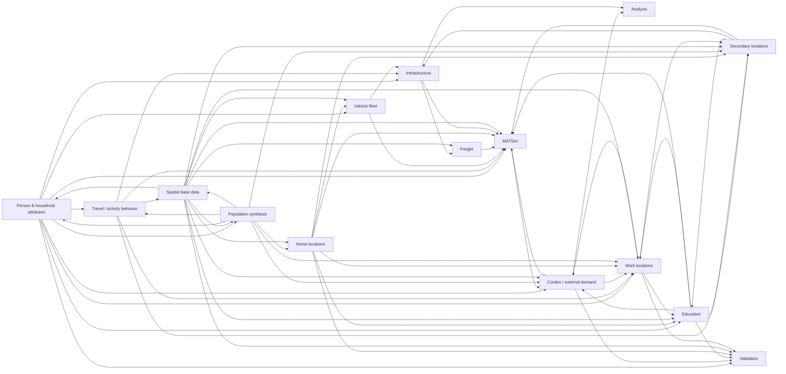

<!-- THIS FILE IS GENERATED. DO NOT EDIT MANUALLY.
     Rebuild: python -m braunschweig.documentation build
     Sources: docs/registry/** + docs/decisions/ + docs/runs/ -->

# Production pipeline (generated)

Extracted from the ACTUAL synpp dependency graph (`docs/registry/dag/production.json`,
`synpp.run(dryrun=True)` over `configs/base_bs.yml` + `configs/overlays/test_100pct.yml`).

Run targets: `braunschweig.analysis.analysis_suite`, `braunschweig.analysis.cordon_validation`, `braunschweig.analysis.simwrapper_export`, `braunschweig.analysis.synthesis.commute_distance_by_kreis`, `braunschweig.analysis.verbindungen_validation`, `matsim.output`, `synthesis.output`; 93 stages, 220 dependencies.

## Model-area flow (condensed)

One edge per dependency between model areas (self-edges dropped):

## Stages per pipeline (reachability)

| Stage | Layer | production | popsim_open | simple_ipf_open |
|---|---|---|---|---|
| `braunschweig.analysis.analysis_suite` | analysis | x | -- | -- |
| `braunschweig.analysis.cordon_validation` | validation | x | -- | -- |
| `braunschweig.analysis.reference.srv.commute_distance` | validation | x | -- | -- |
| `braunschweig.analysis.simwrapper_export` | analysis | x | -- | -- |
| `braunschweig.analysis.synthesis.commute_distance_by_kreis` | validation | x | -- | -- |
| `braunschweig.analysis.verbindungen_validation` | validation | x | -- | -- |
| `braunschweig.data.alkis` | spatial | x | x | x |
| `braunschweig.data.bbsr.regiostar` | spatial | x | x | x |
| `braunschweig.data.bosserhof_location_category` | secondary | x | -- | -- |
| `braunschweig.data.bosserhof_purpose` | secondary | x | -- | -- |
| `braunschweig.data.building_potentials` | work | x | -- | -- |
| `braunschweig.data.buildings` | home | x | x | x |
| `braunschweig.data.census.employees` | work | x | x | x |
| `braunschweig.data.census.employment` | attributes | x | x | x |
| `braunschweig.data.census.household_income` | attributes | -- | -- | x |
| `braunschweig.data.census.household_size` | population | -- | -- | x |
| `braunschweig.data.census.households_size_age` | population | -- | -- | x |
| `braunschweig.data.census.households_type` | population | -- | -- | x |
| `braunschweig.data.census.licenses` | attributes | -- | -- | x |
| `braunschweig.data.census.pendler` | cordon | x | x | x |
| `braunschweig.data.census.population` | population | -- | -- | x |
| `braunschweig.data.cordon_gemeinden` | cordon | x | x | -- |
| `braunschweig.data.cordon_network` | cordon | x | x | -- |
| `braunschweig.data.cordon_pt_gates` | cordon | x | x | -- |
| `braunschweig.data.education.student_share` | education | -- | -- | x |
| `braunschweig.data.external_secondary_points` | secondary | x | -- | -- |
| `braunschweig.data.external_workplaces` | work | x | x | x |
| `braunschweig.data.freight.german_wide` | freight | x | -- | -- |
| `braunschweig.data.hts.mid_donor` | population | x | x | -- |
| `braunschweig.data.inkar.household_income` | attributes | x | x | x |
| `braunschweig.data.landuse` | spatial | x | x | x |
| `braunschweig.data.locations` | secondary | x | x | x |
| `braunschweig.data.mid.data` | behavior | -- | -- | x |
| `braunschweig.data.mid.references` | validation | -- | -- | x |
| `braunschweig.data.mid.zones` | behavior | -- | -- | x |
| `braunschweig.data.osm` | spatial | x | x | x |
| `braunschweig.data.schools.facilities` | education | x | x | -- |
| `braunschweig.data.schools.kita_facilities` | education | x | x | -- |
| `braunschweig.data.schools.university_facilities` | education | x | x | -- |
| `braunschweig.data.verbindungen.margins` | validation | x | -- | -- |
| `braunschweig.data.verbindungen.work_od` | work | x | x | x |
| `braunschweig.data.verbindungen.zones` | spatial | x | x | x |
| `braunschweig.data.vrb.zones` | matsim | x | x | x |
| `braunschweig.data.zensus_grid.population` | home | -- | -- | x |
| `braunschweig.freight.extraction` | freight | x | -- | -- |
| `braunschweig.freight.trips` | freight | x | -- | -- |
| `braunschweig.ipf.model` | population | -- | -- | x |
| `braunschweig.ipf.prepare` | population | -- | -- | x |
| `braunschweig.locations.work` | work | x | -- | -- |
| `braunschweig.popsim.completed_donor` | population | x | -- | -- |
| `braunschweig.synthesis.cordon_gates` | cordon | x | x | -- |
| `braunschweig.synthesis.incommuters` | cordon | x | x | -- |
| `braunschweig.synthesis.locations.education_gravity` | education | x | x | -- |
| `braunschweig.synthesis.locations.secondary_candidates` | secondary | x | -- | -- |
| `braunschweig.synthesis.student_incommuters` | cordon | x | x | -- |
| `braunschweig.synthesis.vehicles.cars.household` | fleet | x | x | x |
| `data.census.filtered` | population | x | x | x |
| `data.gtfs.cleaned` | matsim | x | x | x |
| `data.hts.commute_distance` | behavior | -- | -- | x |
| `data.hts.entd.cleaned` | behavior | x | x | x |
| `data.hts.entd.filtered` | behavior | -- | x | x |
| `data.hts.entd.raw` | behavior | x | x | x |
| `data.hts.entd.reweighted` | behavior | -- | x | x |
| `data.hts.selected` | behavior | -- | x | x |
| `data.od.weighted` | work | x | x | x |
| `data.osm.cleaned` | spatial | x | x | x |
| `data.osm.osmosis` | spatial | x | x | x |
| `data.spatial.codes` | spatial | x | x | x |
| `data.spatial.departments` | spatial | x | x | x |
| `data.spatial.iris` | spatial | x | x | x |
| `data.spatial.municipalities` | spatial | x | x | x |
| `documentation.meta_output` | infrastructure | x | x | x |
| `eqasim_common.data.osm.chunked` | spatial | x | x | x |
| `eqasim_common.data.osm.locations` | secondary | x | x | x |
| `eqasim_common.data.osm.osmconvert` | spatial | x | x | x |
| `eqasim_common.data.population.raw` | population | x | x | x |
| `eqasim_common.gravity.distance_matrix` | work | x | x | x |
| `eqasim_common.locations.synthesis.education` | education | -- | -- | x |
| `eqasim_common.spatial.codes` | spatial | x | x | x |
| `matsim.output` | matsim | x | x | x |
| `matsim.runtime.eqasim` | infrastructure | x | x | x |
| `matsim.runtime.git` | infrastructure | x | x | x |
| `matsim.runtime.java` | infrastructure | x | x | x |
| `matsim.runtime.maven` | infrastructure | x | x | x |
| `matsim.runtime.pt2matsim` | matsim | x | x | x |
| `matsim.scenario.facilities` | matsim | x | x | x |
| `matsim.scenario.households` | matsim | x | x | x |
| `matsim.scenario.population` | matsim | x | x | x |
| `matsim.scenario.supply.gtfs` | matsim | x | x | x |
| `matsim.scenario.supply.osm` | matsim | x | x | x |
| `matsim.scenario.supply.processed` | matsim | x | x | x |
| `matsim.scenario.vehicles` | matsim | x | x | x |
| `matsim.simulation.prepare` | matsim | x | x | x |
| `matsim.simulation.run` | matsim | x | x | x |
| `synthesis.locations.education` | education | x | x | x |
| `synthesis.locations.home.locations` | home | -- | -- | x |
| `synthesis.locations.secondary` | secondary | x | x | x |
| `synthesis.locations.work` | work | -- | x | x |
| `synthesis.output` | infrastructure | x | x | x |
| `synthesis.population.activities` | behavior | x | x | x |
| `synthesis.population.enriched` | attributes | x | x | x |
| `synthesis.population.income.selected` | attributes | -- | -- | x |
| `synthesis.population.matched` | behavior | -- | -- | x |
| `synthesis.population.sampled` | population | x | x | x |
| `synthesis.population.spatial.commute_distance` | work | x | x | x |
| `synthesis.population.spatial.home.locations` | home | x | x | x |
| `synthesis.population.spatial.home.zones` | home | x | x | x |
| `synthesis.population.spatial.locations` | secondary | x | x | x |
| `synthesis.population.spatial.primary.candidates` | work | x | x | x |
| `synthesis.population.spatial.primary.locations` | education | x | x | x |
| `synthesis.population.spatial.secondary.distance_distributions` | secondary | x | x | x |
| `synthesis.population.spatial.secondary.locations` | secondary | x | x | x |
| `synthesis.population.trips` | behavior | x | x | x |
| `synthesis.vehicles.passengers.default` | fleet | x | x | x |
| `synthesis.vehicles.vehicles` | fleet | x | x | x |
